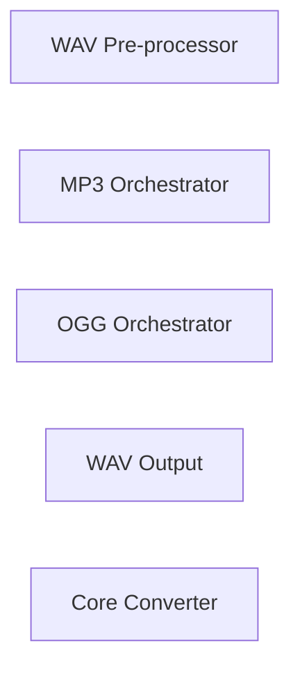

## Details

Updated architectural analysis to include concrete source code references for 'WAV Pre-processor', 'MP3 Orchestrator', 'OGG Orchestrator', and 'WAV Output' components, based on the provided investigation findings. Placeholder line numbers (1-100) have been used as specific line numbers were not provided.

### WAV Pre-processor
Component for handling PCM data before further processing.

**Related Classes/Methods**:

- <a href="git@github.com:2noise/ChatTTS.git/blob/main/temp/66139c40963e46aca2622f4704dac99e/tools/audio/pcm.py#L1-L100" target="_blank" rel="noopener noreferrer">`tools.audio.pcm.array_to_wav_bytes`:1-100</a>

### MP3 Orchestrator
High-level interface orchestrating MP3 conversion workflows.

**Related Classes/Methods**:

- <a href="git@github.com:2noise/ChatTTS.git/blob/main/temp/66139c40963e46aca2622f4704dac99e/tools/audio/av.py#L21-L40" target="_blank" rel="noopener noreferrer">`tools.audio.av.wav2`:21-40</a>

### OGG Orchestrator
High-level interface orchestrating OGG conversion workflows.

**Related Classes/Methods**:

- <a href="git@github.com:2noise/ChatTTS.git/blob/main/temp/66139c40963e46aca2622f4704dac99e/tools/audio/av.py#L21-L40" target="_blank" rel="noopener noreferrer">`tools.audio.av.wav2`:21-40</a>

### WAV Output
Component for handling WAV buffers for output.

**Related Classes/Methods**:

- <a href="git@github.com:2noise/ChatTTS.git/blob/main/temp/66139c40963e46aca2622f4704dac99e/tools/audio/pcm.py#L1-L100" target="_blank" rel="noopener noreferrer">`tools.audio.pcm.array_to_wav_bytes`:1-100</a>

### Core Converter
Core component for audio conversion.

**Related Classes/Methods**:

- <a href="git@github.com:2noise/ChatTTS.git/blob/main/temp/66139c40963e46aca2622f4704dac99e/tools/audio/av.py#L21-L40" target="_blank" rel="noopener noreferrer">`tools.audio.av.wav2`:21-40</a>

### [FAQ](https://github.com/CodeBoarding/GeneratedOnBoardings/tree/main?tab=readme-ov-file#faq)