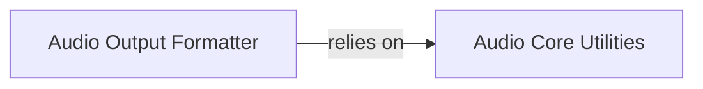

## Details

The Audio Output Utilities subsystem is a crucial part of the ChatTTS project, specifically designed to handle the post-synthesis processing and output of audio data. It aligns with the "Utility Modules" pattern expected in an ML Toolkit/Library, providing essential functionalities for externalizing the synthesized speech.

### Audio Output Formatter
This component is responsible for taking the raw Pulse-Code Modulation (PCM) audio data, which is the direct output from the speech synthesis model, and converting it into widely used audio file formats such as WAV, MP3, and OGG. It acts as the primary interface for externalizing the synthesized audio, making it consumable by various applications or users.

**Related Classes/Methods**:

- <a href="git@github.com:2noise/ChatTTS.git/blob/main/temp/61f936eb8766444da3d6592b4973b108/tools/audio/pcm.py" target="_blank" rel="noopener noreferrer">`tools.audio.pcm`</a>

### Audio Core Utilities
This component provides foundational, lower-level audio processing capabilities. It handles the loading of audio data from various sources into the system and performs robust format conversions. It serves as a utility layer that other components, including Audio Output Formatter, can leverage for basic audio manipulation and I/O.

**Related Classes/Methods**:

- <a href="git@github.com:2noise/ChatTTS.git/blob/main/temp/61f936eb8766444da3d6592b4973b108/tools/audio/av.py" target="_blank" rel="noopener noreferrer">`tools.audio.av`</a>

### [FAQ](https://github.com/CodeBoarding/GeneratedOnBoardings/tree/main?tab=readme-ov-file#faq)