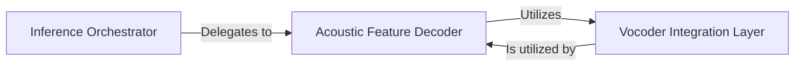

## Details

The Audio Synthesis Module (Vocoder) subsystem is primarily defined by the ChatTTS.core module, specifically focusing on the functions responsible for converting acoustic features into audible waveforms.

### Inference Orchestrator
This component serves as the high-level coordinator for the entire text-to-speech inference pipeline. It initiates and manages the sequence of operations, from initial text processing (not detailed here) through to the final audio waveform generation. Within the context of the audio synthesis module, it is responsible for triggering the acoustic feature decoding process.

**Related Classes/Methods**:

- <a href="git@github.com:2noise/ChatTTS.git/blob/main/temp/61f936eb8766444da3d6592b4973b108/ChatTTS/core.py#L208-L270" target="_blank" rel="noopener noreferrer">`ChatTTS.core.infer`:208-270</a>

### Acoustic Feature Decoder
This component is responsible for processing and preparing the intermediate acoustic features (e.g., mel-spectrograms or other representations) for the vocoder. It ensures that the features are in the correct format, shape, and state required for efficient and accurate waveform generation by the subsequent vocoder integration layer. It acts as a crucial intermediary, bridging the gap between the acoustic model's output and the vocoder's input.

**Related Classes/Methods**:

- <a href="git@github.com:2noise/ChatTTS.git/blob/main/temp/61f936eb8766444da3d6592b4973b108/ChatTTS/core.py#L512-L539" target="_blank" rel="noopener noreferrer">`ChatTTS.core._decode_to_wavs`:512-539</a>

### Vocoder Integration Layer
This component is the direct interface to the vocos vocoder model. Its core responsibility is to take the prepared acoustic features and convert them into raw, time-domain audio waveforms. It encapsulates the specific logic, model loading, and inference calls required to interact with the underlying vocos library, performing the actual sound generation.

**Related Classes/Methods**:

- <a href="git@github.com:2noise/ChatTTS.git/blob/main/temp/61f936eb8766444da3d6592b4973b108/ChatTTS/core.py#L505-L510" target="_blank" rel="noopener noreferrer">`ChatTTS.core._vocos_decode`:505-510</a>

### [FAQ](https://github.com/CodeBoarding/GeneratedOnBoardings/tree/main?tab=readme-ov-file#faq)