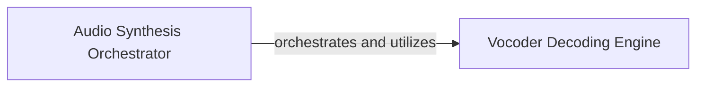

## Details

This subsystem focuses on the final stage of the ChatTTS pipeline: converting processed acoustic features into audible WAV audio. It embodies the "Pipeline/Workflow" and "Core Speech Synthesis Model/Engine" architectural patterns, crucial for an ML Toolkit/Library in speech technology.

### Audio Synthesis Orchestrator [[Expand]](./Audio_Synthesis_Orchestrator.md)
This component orchestrates the high-level process of converting acoustic features (e.g., mel-spectrograms) into audible WAV audio. It serves as the primary entry point for the final audio generation pipeline within the ChatTTS core, managing the flow and coordination of the decoding process. It acts as a control layer for the synthesis process, ensuring the correct sequence of operations.

**Related Classes/Methods**:

- <a href="git@github.com:2noise/ChatTTS.git/blob/main/temp/66139c40963e46aca2622f4704dac99e/ChatTTS/core.py#L512-L539" target="_blank" rel="noopener noreferrer">`ChatTTS.core._decode_to_wavs`:512-539</a>

### Vocoder Decoding Engine
This component performs the low-level, core computational task of decoding acoustic features into raw audio data, likely utilizing a vocoder model. It is the fundamental engine responsible for the actual sound generation, embodying the "Core Speech Synthesis Model/Engine" pattern. It takes the abstract acoustic representation and transforms it into a time-domain waveform.

**Related Classes/Methods**:

- <a href="git@github.com:2noise/ChatTTS.git/blob/main/temp/66139c40963e46aca2622f4704dac99e/ChatTTS/core.py#L505-L510" target="_blank" rel="noopener noreferrer">`ChatTTS.core._vocos_decode`:505-510</a>

### [FAQ](https://github.com/CodeBoarding/GeneratedOnBoardings/tree/main?tab=readme-ov-file#faq)