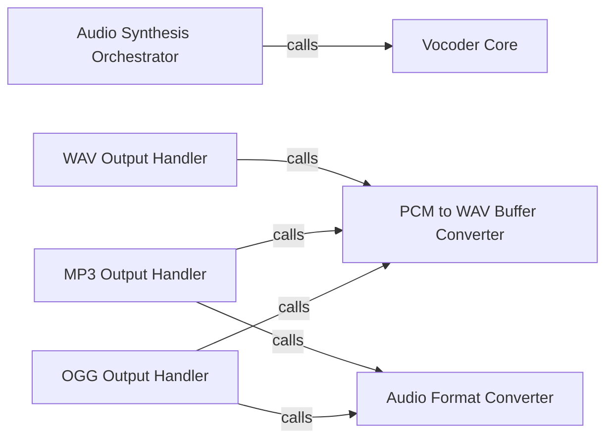

## Details

The Audio Synthesis & Output subsystem is responsible for transforming acoustic features into audible audio and handling various output formats. Its boundaries are primarily defined by ChatTTS/core.py for core synthesis logic and tools/audio/pcm.py and tools/audio/av.py for audio formatting and output utilities.

### Audio Synthesis Orchestrator [[Expand]](./Audio_Synthesis_Orchestrator.md)
Orchestrates the high-level process of converting acoustic features (e.g., mel-spectrograms) into audible WAV audio. It serves as the primary entry point for the audio generation pipeline within the ChatTTS core.

**Related Classes/Methods**:

- <a href="git@github.com:2noise/ChatTTS.git/blob/main/temp/66139c40963e46aca2622f4704dac99e/ChatTTS/core.py#L512-L539" target="_blank" rel="noopener noreferrer">`ChatTTS.core._decode_to_wavs`:512-539</a>

### Vocoder Core
Implements the core vocoder logic, transforming abstract acoustic features into raw, time-domain audio data (likely PCM). This component is where the actual "sound" is synthesized from the acoustic representation.

**Related Classes/Methods**:

- <a href="git@github.com:2noise/ChatTTS.git/blob/main/temp/66139c40963e46aca2622f4704dac99e/ChatTTS/core.py#L505-L510" target="_blank" rel="noopener noreferrer">`ChatTTS.core._vocos_decode`:505-510</a>

### PCM to WAV Buffer Converter
A foundational utility that converts raw PCM audio data into a standardized WAV file buffer. This acts as an intermediate, common format for subsequent output operations, ensuring compatibility across different audio formats.

**Related Classes/Methods**:

- <a href="git@github.com:2noise/ChatTTS.git/blob/main/temp/66139c40963e46aca2622f4704dac99e/tools/audio/pcm.py#L8-L32" target="_blank" rel="noopener noreferrer">`tools.audio.pcm._pcm_to_wav_buffer`:8-32</a>

### WAV Output Handler
Handles the final presentation and output of audio as a WAV file. It takes the processed audio data and formats it into a standard WAV view for direct consumption or further processing.

**Related Classes/Methods**:

- <a href="git@github.com:2noise/ChatTTS.git/blob/main/temp/66139c40963e46aca2622f4704dac99e/tools/audio/pcm.py#L73-L91" target="_blank" rel="noopener noreferrer">`tools.audio.pcm.pcm_arr_to_wav_view`:73-91</a>

### MP3 Output Handler
Manages the conversion and output of audio into MP3 format. It first prepares the audio as WAV and then leverages a general audio format converter to produce the MP3 output.

**Related Classes/Methods**:

- <a href="git@github.com:2noise/ChatTTS.git/blob/main/temp/66139c40963e46aca2622f4704dac99e/tools/audio/pcm.py#L35-L51" target="_blank" rel="noopener noreferrer">`tools.audio.pcm.pcm_arr_to_mp3_view`:35-51</a>

### OGG Output Handler
Manages the conversion and output of audio into OGG format. Similar to the MP3 handler, it prepares the audio as WAV and then uses a general audio format converter for OGG conversion.

**Related Classes/Methods**:

- <a href="git@github.com:2noise/ChatTTS.git/blob/main/temp/66139c40963e46aca2622f4704dac99e/tools/audio/pcm.py#L54-L70" target="_blank" rel="noopener noreferrer">`tools.audio.pcm.pcm_arr_to_ogg_view`:54-70</a>

### Audio Format Converter [[Expand]](./Audio_Format_Converter.md)
A general-purpose utility for converting WAV audio data into other specified audio formats (e.g., MP3, OGG). It abstracts away the specifics of different audio codecs, providing a unified conversion interface.

**Related Classes/Methods**:

- <a href="git@github.com:2noise/ChatTTS.git/blob/main/temp/66139c40963e46aca2622f4704dac99e/tools/audio/av.py#L21-L40" target="_blank" rel="noopener noreferrer">`tools.audio.av.wav2`:21-40</a>

### [FAQ](https://github.com/CodeBoarding/GeneratedOnBoardings/tree/main?tab=readme-ov-file#faq)