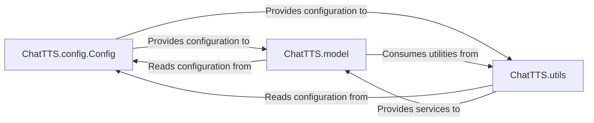

## Details

The ChatTTS system is architected around three primary high-level components: `ChatTTS.config.Config`, `ChatTTS.model`, and `ChatTTS.utils`. The `ChatTTS.config.Config` component serves as the central repository for all system-wide configuration settings, providing essential parameters and asset paths to other parts of the system. The `ChatTTS.model` component encapsulates the core speech synthesis models, such as DVAE, GPT, and Embed, which are responsible for the primary text-to-speech transformations. These models are initialized and guided by the configurations provided by `ChatTTS.config.Config`. Complementing these, the `ChatTTS.utils` component offers a suite of general-purpose utility functions, including asset management, device selection, and file I/O, which support the operational needs of both the configuration and model components, ensuring efficient and consistent system behavior.

### ChatTTS.config.Config [[Expand]](./ChatTTS_config_Config.md)
This is the core component of the configuration subsystem. It serves as the central repository for all system-wide configuration settings, aggregating specific configuration objects for various sub-models and pipeline stages (e.g., `Path`, `Decoder`, `DVAE`, `GPT`, `Embed`, `Vocos`). It ensures that all parts of the ChatTTS system can access consistent and pre-defined parameters for initialization and operation.

**Related Classes/Methods**:

- <a href="git@github.com:2noise/ChatTTS.git/blob/main/temp/66139c40963e46aca2622f4704dac99e/ChatTTS/config/config.py" target="_blank" rel="noopener noreferrer">`ChatTTS.config.Config`</a>

### ChatTTS.model [[Expand]](./ChatTTS_model.md)
Represents the core speech synthesis models (e.g., `DVAE`, `Embed`, `GPT`, `Speaker`, `Tokenizer`) that constitute the main computational logic of the ChatTTS toolkit. These models require specific configuration settings to be initialized and operate correctly, and they perform the actual text-to-speech transformations.

**Related Classes/Methods**:

- <a href="git@github.com:2noise/ChatTTS.git/blob/main/temp/66139c40963e46aca2622f4704dac99e/ChatTTS/model/__init__.py" target="_blank" rel="noopener noreferrer">`ChatTTS.model`</a>

### ChatTTS.utils
Encompasses various utility functions and helper modules that support the overall operation of the ChatTTS toolkit. These utilities include functionalities for asset management (`check_all_assets`, `download_all_assets`), device selection (`select_device`), and file I/O (`load_safetensors`, `get_latest_modified_file`).

**Related Classes/Methods**:

- <a href="git@github.com:2noise/ChatTTS.git/blob/main/temp/66139c40963e46aca2622f4704dac99e/ChatTTS/utils/__init__.py" target="_blank" rel="noopener noreferrer">`ChatTTS.utils`</a>

### [FAQ](https://github.com/CodeBoarding/GeneratedOnBoardings/tree/main?tab=readme-ov-file#faq)