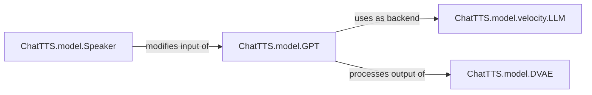

## Details

The `ChatTTS.model` subsystem is designed for efficient and customizable speech synthesis. It encompasses `gpt`, `dvae`, `speaker`, and `velocity` components. `ChatTTS.model.GPT` is the primary generative model, optionally accelerated by `ChatTTS.model.velocity.LLM`. `ChatTTS.model.Speaker` provides speaker-specific embeddings to `GPT`, and `ChatTTS.model.DVAE` processes `GPT`'s output into audio waveforms.

### ChatTTS.model.GPT
Serves as the primary generative model, orchestrating the text-to-feature or text-to-audio generation process. It configures and loads the underlying Llama model (or delegates to `velocity.LLM`), prepares inputs, and processes outputs.

**Related Classes/Methods**:

- <a href="git@github.com:2noise/ChatTTS.git/blob/main/temp/66139c40963e46aca2622f4704dac99e/ChatTTS/model/gpt.py" target="_blank" rel="noopener noreferrer">`ChatTTS.model.GPT`</a>

### ChatTTS.model.DVAE
Functions as a Discrete Variational Autoencoder, responsible for converting raw audio into discrete audio tokens (encoding) and reconstructing audio waveforms from these discrete tokens (decoding). It handles mel-spectrogram feature extraction and quantization.

**Related Classes/Methods**:

- <a href="git@github.com:2noise/ChatTTS.git/blob/main/temp/66139c40963e46aca2622f4704dac99e/ChatTTS/model/dvae.py" target="_blank" rel="noopener noreferrer">`ChatTTS.model.DVAE`</a>

### ChatTTS.model.Speaker
Manages speaker-specific information, including sampling random speaker embeddings and applying these embeddings to the input sequences of the generative model to control voice characteristics. It also handles prompt decoration with speaker tokens.

**Related Classes/Methods**:

- <a href="git@github.com:2noise/ChatTTS.git/blob/main/temp/66139c40963e46aca2622f4704dac99e/ChatTTS/model/speaker.py" target="_blank" rel="noopener noreferrer">`ChatTTS.model.Speaker`</a>

### ChatTTS.model.velocity.LLM
Provides a high-performance, optimized inference engine for large language models. It manages request batching, scheduling, and efficient execution of the LLM, significantly accelerating the generation process when enabled.

**Related Classes/Methods**:

- <a href="git@github.com:2noise/ChatTTS.git/blob/main/temp/66139c40963e46aca2622f4704dac99e/ChatTTS/model/velocity/llm.py" target="_blank" rel="noopener noreferrer">`ChatTTS.model.velocity.LLM`</a>

### [FAQ](https://github.com/CodeBoarding/GeneratedOnBoardings/tree/main?tab=readme-ov-file#faq)