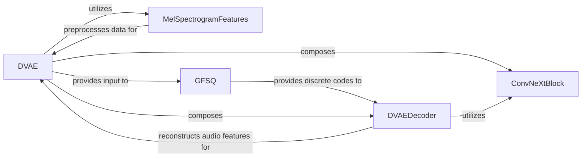

## Details

The DVAE (Discrete Variational Autoencoder) subsystem in ChatTTS is designed for learning discrete audio representations. It operates by first transforming raw audio into mel-spectrogram features using `MelSpectrogramFeatures`. These features are then processed by the `DVAE`'s encoder, which incorporates `ConvNeXtBlock`s for hierarchical feature extraction. The encoded continuous representations are then quantized into discrete codes by the `GFSQ` component. Finally, the `DVAEDecoder` reconstructs audio features from these discrete codes, completing the autoencoding process. This modular design allows for clear separation of concerns, from data preprocessing to the core encoding, quantization, and decoding steps.

### DVAE [[Expand]](./DVAE.md)
The primary orchestrator and core model component of the DVAE. It encapsulates the end-to-end logic for learning discrete audio representations, managing the entire autoencoder architecture from input feature extraction through encoding, quantization, and decoding.

**Related Classes/Methods**:

- <a href="git@github.com:2noise/ChatTTS.git/blob/main/temp/66139c40963e46aca2622f4704dac99e/ChatTTS/model/dvae.py#L209-L303" target="_blank" rel="noopener noreferrer">`ChatTTS.model.dvae.DVAE`:209-303</a>

### MelSpectrogramFeatures
A pre-processing component responsible for transforming raw audio signals into mel-spectrogram representations. This is a standard initial step in speech processing pipelines, preparing data for neural network consumption within the DVAE.

**Related Classes/Methods**:

- <a href="git@github.com:2noise/ChatTTS.git/blob/main/temp/66139c40963e46aca2622f4704dac99e/ChatTTS/model/processors.py" target="_blank" rel="noopener noreferrer">`ChatTTS.model.processors.MelSpectrogramFeatures`</a>

### ConvNeXtBlock
A fundamental, reusable architectural building block within the DVAE's neural network. It performs specific feature extraction and transformation using convolutional layers, contributing to the model's ability to learn hierarchical representations.

**Related Classes/Methods**:

- <a href="git@github.com:2noise/ChatTTS.git/blob/main/temp/66139c40963e46aca2622f4704dac99e/ChatTTS/model/dvae.py#L14-L66" target="_blank" rel="noopener noreferrer">`ChatTTS.model.dvae.ConvNeXtBlock`:14-66</a>

### GFSQ
A specialized component critical for the "discrete" aspect of the DVAE. It handles the quantization of continuous latent representations into discrete codes, enabling the model to learn a discrete latent space.

**Related Classes/Methods**:

- <a href="git@github.com:2noise/ChatTTS.git/blob/main/temp/66139c40963e46aca2622f4704dac99e/ChatTTS/model/dvae.py#L69-L128" target="_blank" rel="noopener noreferrer">`ChatTTS.model.dvae.GFSQ`:69-128</a>

### DVAEDecoder [[Expand]](./DVAEDecoder.md)
The component responsible for reconstructing the output (e.g., audio features) from the discrete latent codes generated by the DVAE's encoder. It translates learned latent representations back into a meaningful output format.

**Related Classes/Methods**:

- <a href="git@github.com:2noise/ChatTTS.git/blob/main/temp/66139c40963e46aca2622f4704dac99e/ChatTTS/model/dvae.py#L131-L172" target="_blank" rel="noopener noreferrer">`ChatTTS.model.dvae.DVAEDecoder`:131-172</a>

### [FAQ](https://github.com/CodeBoarding/GeneratedOnBoardings/tree/main?tab=readme-ov-file#faq)