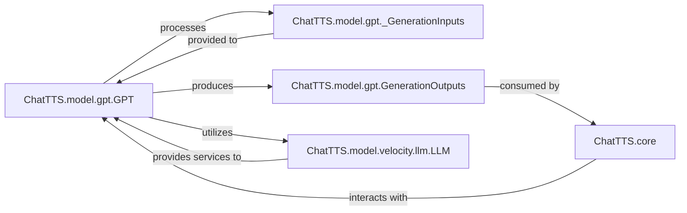

## Details

The ChatTTS system is orchestrated by the ChatTTS.core component, which serves as the central application logic. It initializes and manages the ChatTTS.model.gpt.GPT, the core speech synthesis model. The ChatTTS.model.gpt.GPT component is responsible for generating speech codes, taking ChatTTS.model.gpt._GenerationInputs as input and producing ChatTTS.model.gpt.GenerationOutputs. This core GPT model relies on ChatTTS.model.velocity.llm.LLM for its underlying generative capabilities. The ChatTTS.core component consumes the ChatTTS.model.gpt.GenerationOutputs to complete the text-to-speech process. This architecture highlights a clear separation of concerns, with ChatTTS.core handling orchestration, ChatTTS.model.gpt.GPT managing speech synthesis, and ChatTTS.model.velocity.llm.LLM providing foundational language model services.

### ChatTTS.model.gpt.GPT [[Expand]](./ChatTTS_model_gpt_GPT.md)
The core speech synthesis model, responsible for generating speech codes from processed text. It handles model initialization, loading pre-trained weights, managing the generation process, and preparing data for both input and output. This component embodies the "Core Speech Synthesis Model/Engine" pattern.

**Related Classes/Methods**:

- <a href="git@github.com:2noise/ChatTTS.git/blob/main/temp/66139c40963e46aca2622f4704dac99e/ChatTTS/model/gpt.py" target="_blank" rel="noopener noreferrer">`ChatTTS.model.gpt.GPT`</a>

### ChatTTS.model.gpt._GenerationInputs
A structured data container for the inputs required by the GPT model for the generation process. It ensures consistent input formatting, aligning with "Model and Data Management."

**Related Classes/Methods**:

- <a href="git@github.com:2noise/ChatTTS.git/blob/main/temp/66139c40963e46aca2622f4704dac99e/ChatTTS/model/gpt.py#L141-L159" target="_blank" rel="noopener noreferrer">`ChatTTS.model.gpt._GenerationInputs`:141-159</a>

### ChatTTS.model.gpt.GenerationOutputs
A structured data container for the results produced by the GPT model during the speech code generation process. This component aligns with "Model and Data Management" by defining the output contract of the core model.

**Related Classes/Methods**:

- <a href="git@github.com:2noise/ChatTTS.git/blob/main/temp/66139c40963e46aca2622f4704dac99e/ChatTTS/model/gpt.py#L276-L285" target="_blank" rel="noopener noreferrer">`ChatTTS.model.gpt.GenerationOutputs`:276-285</a>

### ChatTTS.model.velocity.llm.LLM
Represents the underlying Large Language Model component that ChatTTS.model.gpt.GPT depends on for its core generative capabilities. It provides the foundational LLM services necessary for speech code generation.

**Related Classes/Methods**:

- <a href="git@github.com:2noise/ChatTTS.git/blob/main/temp/66139c40963e46aca2622f4704dac99e/ChatTTS/model/velocity/llm.py#L13-L213" target="_blank" rel="noopener noreferrer">`ChatTTS.model.velocity.llm.LLM`:13-213</a>

### ChatTTS.core
The central orchestrator of the ChatTTS system, responsible for initializing the main model, managing the inference process, and handling the overall flow of text-to-speech generation. It acts as the primary interface for users to interact with the speech synthesis capabilities. This component embodies the "Application Core/Orchestrator" pattern.

**Related Classes/Methods**:

### [FAQ](https://github.com/CodeBoarding/GeneratedOnBoardings/tree/main?tab=readme-ov-file#faq)