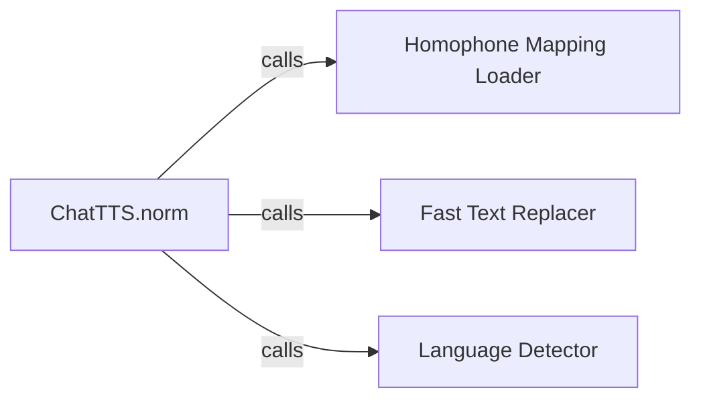

## Details

Analysis of the `ChatTTS.norm` subsystem, which is dedicated to standardizing raw text input for the speech synthesis model.

### ChatTTS.norm [[Expand]](./ChatTTS_norm.md)
This is the overarching component that orchestrates the entire text normalization pipeline. It initializes necessary configurations and data, such as homophone mappings, and defines the sequence of operations (character mapping, tag manipulation, homophone replacement, language detection) applied to the input text. Its `__call__` method serves as the primary entry point for the normalization process.

**Related Classes/Methods**:

- <a href="git@github.com:2noise/ChatTTS.git/blob/main/temp/66139c40963e46aca2622f4704dac99e/ChatTTS/norm.py" target="_blank" rel="noopener noreferrer">`ChatTTS.norm`</a>
- <a href="git@github.com:2noise/ChatTTS.git/blob/main/temp/66139c40963e46aca2622f4704dac99e/ChatTTS/norm.py" target="_blank" rel="noopener noreferrer">`ChatTTS.norm:__call__`</a>
- <a href="git@github.com:2noise/ChatTTS.git/blob/main/temp/66139c40963e46aca2622f4704dac99e/ChatTTS/norm.py" target="_blank" rel="noopener noreferrer">`ChatTTS.norm:__init__`</a>

### Homophone Mapping Loader
Responsible for loading and preparing the homophone mapping data. This data is critical for standardizing text by replacing homophones, ensuring linguistic consistency before speech synthesis.

**Related Classes/Methods**:

- <a href="git@github.com:2noise/ChatTTS.git/blob/main/temp/66139c40963e46aca2622f4704dac99e/ChatTTS/norm.py#L226-L233" target="_blank" rel="noopener noreferrer">`ChatTTS.norm._load_homophones_map`:226-233</a>

### Fast Text Replacer
Provides an efficient utility for performing string replacement operations. This component is crucial for applying various text transformations, including homophone replacements and character mapping, to standardize the input text.

**Related Classes/Methods**:

- <a href="git@github.com:2noise/ChatTTS.git/blob/main/temp/66139c40963e46aca2622f4704dac99e/ChatTTS/norm.py#L21-L34" target="_blank" rel="noopener noreferrer">`ChatTTS.norm._fast_replace`:21-34</a>

### Language Detector
Determines the language of the input text after it has undergone normalization. This output is vital for subsequent language-specific processing steps in the broader speech synthesis model, ensuring correct pronunciation and intonation.

**Related Classes/Methods**:

- <a href="git@github.com:2noise/ChatTTS.git/blob/main/temp/66139c40963e46aca2622f4704dac99e/ChatTTS/norm.py#L246-L253" target="_blank" rel="noopener noreferrer">`ChatTTS.norm._detect_language`:246-253</a>

### [FAQ](https://github.com/CodeBoarding/GeneratedOnBoardings/tree/main?tab=readme-ov-file#faq)