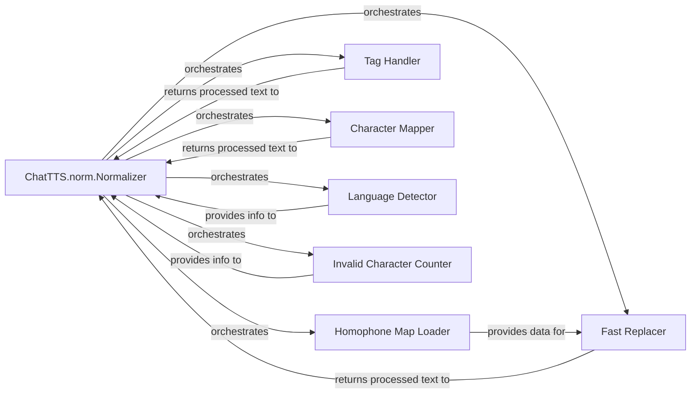

## Details

The `ChatTTS.norm.Normalizer` subsystem is a self-contained unit within the `ChatTTS` project, primarily responsible for the comprehensive preprocessing of input text before it is fed into speech synthesis models. It is encapsulated within the `ChatTTS.norm` module, with its core functionality centered around the `ChatTTS.norm.Normalizer` class and its associated helper functions. This subsystem's boundary is defined by its singular focus on text normalization, including homophone replacement, character mapping, and tag handling, ensuring the text is in an optimal format for subsequent speech generation.

### ChatTTS.norm.Normalizer [[Expand]](./ChatTTS_norm_Normalizer.md)
This is the primary component that orchestrates the entire text normalization pipeline. It initializes necessary resources (like homophone maps) and sequentially applies various normalization steps to the input text by invoking other specialized components. It acts as the central control flow for the subsystem.

**Related Classes/Methods**:

- <a href="git@github.com:2noise/ChatTTS.git/blob/main/temp/66139c40963e46aca2622f4704dac99e/ChatTTS/norm.py" target="_blank" rel="noopener noreferrer">`ChatTTS.norm.Normalizer`</a>

### Homophone Map Loader
Responsible for loading and preparing the homophone mapping data from `res/homophones_map.json`. This data is crucial for the `Fast Replacer` component to perform accurate homophone substitutions during the normalization process.

**Related Classes/Methods**:

- <a href="git@github.com:2noise/ChatTTS.git/blob/main/temp/66139c40963e46aca2622f4704dac99e/ChatTTS/norm.py#L226-L233" target="_blank" rel="noopener noreferrer">`ChatTTS.norm._load_homophones_map`:226-233</a>

### Tag Handler
Manages special tags (e.g., SSML tags) embedded within the input text. It ensures these tags are correctly extracted and preserved before the plain text undergoes normalization, and then re-integrated into the text after processing to maintain structural integrity.

**Related Classes/Methods**:

- <a href="git@github.com:2noise/ChatTTS.git/blob/main/temp/66139c40963e46aca2622f4704dac99e/ChatTTS/norm.py#L37-L57" target="_blank" rel="noopener noreferrer">`ChatTTS.norm._split_tags`:37-57</a>
- <a href="git@github.com:2noise/ChatTTS.git/blob/main/temp/66139c40963e46aca2622f4704dac99e/ChatTTS/norm.py#L60-L68" target="_blank" rel="noopener noreferrer">`ChatTTS.norm._combine_tags`:60-68</a>

### Character Mapper
Applies character-level transformations to the text. This includes mapping specific characters to their normalized forms and converting half-width characters to full-width characters, ensuring consistency and uniformity in the text representation.

**Related Classes/Methods**:

- <a href="git@github.com:2noise/ChatTTS.git/blob/main/temp/66139c40963e46aca2622f4704dac99e/ChatTTS/norm.py#L243-L244" target="_blank" rel="noopener noreferrer">`ChatTTS.norm._apply_character_map`:243-244</a>
- <a href="git@github.com:2noise/ChatTTS.git/blob/main/temp/66139c40963e46aca2622f4704dac99e/ChatTTS/norm.py#L240-L241" target="_blank" rel="noopener noreferrer">`ChatTTS.norm._apply_half2full_map`:240-241</a>

### Fast Replacer
Efficiently performs text replacements based on predefined rules or maps, particularly for homophone substitution. It utilizes an optimized index-finding mechanism to quickly locate and substitute target phrases or characters within the text.

**Related Classes/Methods**:

- <a href="git@github.com:2noise/ChatTTS.git/blob/main/temp/66139c40963e46aca2622f4704dac99e/ChatTTS/norm.py#L21-L34" target="_blank" rel="noopener noreferrer">`ChatTTS.norm._fast_replace`:21-34</a>
- <a href="git@github.com:2noise/ChatTTS.git/blob/main/temp/66139c40963e46aca2622f4704dac99e/ChatTTS/norm.py#L13-L18" target="_blank" rel="noopener noreferrer">`ChatTTS.norm._find_index`:13-18</a>

### Language Detector
Infers the language of the input text. This information can be crucial for guiding language-specific normalization rules or for selecting the appropriate homophone maps, ensuring that the normalization process is linguistically accurate.

**Related Classes/Methods**:

- <a href="git@github.com:2noise/ChatTTS.git/blob/main/temp/66139c40963e46aca2622f4704dac99e/ChatTTS/norm.py#L246-L253" target="_blank" rel="noopener noreferrer">`ChatTTS.norm._detect_language`:246-253</a>

### Invalid Character Counter
Identifies and counts characters within the text that are considered invalid or problematic for further processing. This component can be used for quality control, error handling, or logging purposes, flagging text that might cause issues downstream.

**Related Classes/Methods**:

- <a href="git@github.com:2noise/ChatTTS.git/blob/main/temp/66139c40963e46aca2622f4704dac99e/ChatTTS/norm.py#L235-L238" target="_blank" rel="noopener noreferrer">`ChatTTS.norm._count_invalid_characters`:235-238</a>

### [FAQ](https://github.com/CodeBoarding/GeneratedOnBoardings/tree/main?tab=readme-ov-file#faq)