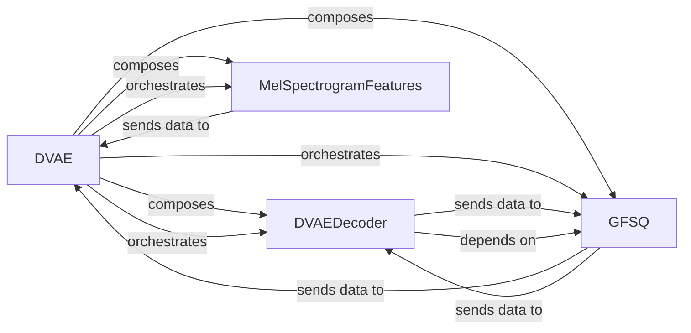

## Details

The DVAE subsystem is orchestrated by the `DVAE` component, which serves as the central control unit for the entire discrete variational autoencoder process. It structurally `composes` and actively `orchestrates` the operations of its key sub-components: `MelSpectrogramFeatures`, `GFSQ`, and `DVAEDecoder`. The primary data flow initiates with `MelSpectrogramFeatures` converting raw audio into Mel spectrograms, which are then `sends data to` the `DVAE` component for further processing. Within the DVAE's operational cycle, `GFSQ` plays a critical role in handling the quantization and embedding of features, `sends data to` `DVAE` with processed data. A crucial interaction pathway exists between `DVAEDecoder` and `GFSQ`, where `DVAEDecoder` `sends data to` `GFSQ` for quantization, and `GFSQ` in turn `sends data to` `DVAEDecoder` with embedded discrete codes, forming a loop essential for discrete representation management. Furthermore, `DVAEDecoder` `depends on` `GFSQ` for its functionality, highlighting the tight coupling in their roles. The DVAE subsystem, orchestrated by the `DVAE` component, is responsible for the transformation of acoustic features using a discrete variational autoencoder approach. It integrates `MelSpectrogramFeatures` to preprocess raw audio into Mel spectrograms, which serve as the initial input. The `DVAE` component then manages the flow, utilizing `GFSQ` for the critical task of quantizing continuous features into discrete codes and embedding these codes back into continuous representations. The `DVAEDecoder` component, a core neural network module, decodes latent representations into acoustic features, often interacting with `GFSQ` to handle the discrete code transformations. This architecture highlights the clear separation of concerns for preprocessing, orchestration, quantization, and decoding, enabling a modular and efficient acoustic modeling pipeline.

### DVAE [[Expand]](./DVAE.md)
The top-level component that orchestrates the entire DVAE process. It manages the flow between encoding (if configured) and decoding stages, coordinating the sub-components to transform latent codes into acoustic features.

**Related Classes/Methods**:

- <a href="git@github.com:2noise/ChatTTS.git/blob/main/temp/66139c40963e46aca2622f4704dac99e/ChatTTS/model/dvae.py#L209-L303" target="_blank" rel="noopener noreferrer">`ChatTTS.model.dvae.DVAE`:209-303</a>

### DVAEDecoder [[Expand]](./DVAEDecoder.md)
The core neural network module responsible for transforming latent representations (codes) into acoustic features during the decoding phase. It can also optionally process Mel spectrograms into latent codes during an encoding phase.

**Related Classes/Methods**:

- <a href="git@github.com:2noise/ChatTTS.git/blob/main/temp/66139c40963e46aca2622f4704dac99e/ChatTTS/model/dvae.py#L131-L172" target="_blank" rel="noopener noreferrer">`ChatTTS.model.dvae.DVAEDecoder`:131-172</a>

### GFSQ
Handles the quantization of continuous features into discrete codes and the embedding of discrete codes back into continuous features. This component is crucial for managing discrete representations within the DVAE model, enabling the conversion between continuous and discrete domains.

**Related Classes/Methods**:

- <a href="git@github.com:2noise/ChatTTS.git/blob/main/temp/66139c40963e46aca2622f4704dac99e/ChatTTS/model/dvae.py#L69-L128" target="_blank" rel="noopener noreferrer">`ChatTTS.model.dvae.GFSQ`:69-128</a>

### MelSpectrogramFeatures
A preprocessing component that converts raw audio input into Mel spectrograms. These spectrograms serve as a standard acoustic representation used by the encoder path of the DVAE, providing the initial input for the model's analysis.

**Related Classes/Methods**:

- <a href="git@github.com:2noise/ChatTTS.git/blob/main/temp/66139c40963e46aca2622f4704dac99e/ChatTTS/model/dvae.py#L175-L206" target="_blank" rel="noopener noreferrer">`ChatTTS.model.dvae.MelSpectrogramFeatures`:175-206</a>

### [FAQ](https://github.com/CodeBoarding/GeneratedOnBoardings/tree/main?tab=readme-ov-file#faq)