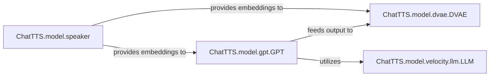

## Details

The `Core Generative Models` subsystem encompasses the primary neural network models responsible for transforming processed text into acoustic features and incorporating speaker characteristics. This includes the GPT-based text-to-code model, the DVAE for converting discrete codes to continuous representations, and the speaker embedding logic.

### ChatTTS.model.gpt.GPT
Transforms input text into a sequence of discrete acoustic codes. It acts as the primary text-to-code generative model, leveraging a GPT-based architecture. This component is fundamental as it initiates the text-to-speech conversion by generating the initial acoustic representation from text.

**Related Classes/Methods**:

- <a href="git@github.com:2noise/ChatTTS.git/blob/main/temp/61f936eb8766444da3d6592b4973b108/ChatTTS/model/gpt.py" target="_blank" rel="noopener noreferrer">`ChatTTS.model.gpt.GPT`</a>

### ChatTTS.model.dvae.DVAE
Processes discrete acoustic codes (received from GPT) and converts them into continuous acoustic representations, bridging the gap between symbolic codes and raw audio features. This component is crucial for translating the abstract acoustic codes into a format suitable for audio synthesis.

**Related Classes/Methods**:

- <a href="git@github.com:2noise/ChatTTS.git/blob/main/temp/61f936eb8766444da3d6592b4973b108/ChatTTS/model/dvae.py#L209-L303" target="_blank" rel="noopener noreferrer">`ChatTTS.model.dvae.DVAE`:209-303</a>

### ChatTTS.model.speaker
Manages and applies speaker-specific characteristics to influence the generated audio's voice timbre and style. This includes encoding and sampling speaker embeddings. This component is vital for enabling diverse voice outputs and personalization.

**Related Classes/Methods**:

- <a href="git@github.com:2noise/ChatTTS.git/blob/main/temp/61f936eb8766444da3d6592b4973b108/ChatTTS/model/speaker.py" target="_blank" rel="noopener noreferrer">`ChatTTS.model.speaker`</a>

### ChatTTS.model.velocity.llm.LLM
Provides an optimized, high-performance inference engine for large language models, specifically utilized by `ChatTTS.model.gpt.GPT` for efficient execution. This component is critical for the performance and scalability of the GPT model within the synthesis pipeline.

**Related Classes/Methods**:

- <a href="git@github.com:2noise/ChatTTS.git/blob/main/temp/61f936eb8766444da3d6592b4973b108/ChatTTS/model/velocity/llm.py#L13-L213" target="_blank" rel="noopener noreferrer">`ChatTTS.model.velocity.llm.LLM`:13-213</a>

### [FAQ](https://github.com/CodeBoarding/GeneratedOnBoardings/tree/main?tab=readme-ov-file#faq)