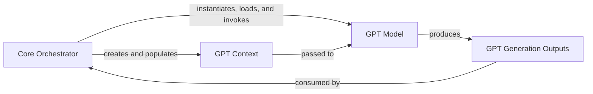

## Details

The Core Orchestrator subsystem is primarily defined by the ChatTTS.core class, located in ChatTTS/core.py. This class serves as the central entry point and coordinator for the entire speech synthesis pipeline within the ChatTTS library.

### Core Orchestrator [[Expand]](./Core_Orchestrator.md)
The primary interface and control hub for the ChatTTS library. It manages the lifecycle of the underlying GPT model, orchestrates the end-to-end speech synthesis pipeline from text input to audio output, and integrates various sub-processes like text refinement, code inference, and vocoder decoding. It also handles model loading, unloading, and speaker sampling.

**Related Classes/Methods**:

- <a href="git@github.com:2noise/ChatTTS.git/blob/main/temp/66139c40963e46aca2622f4704dac99e/ChatTTS/core.py" target="_blank" rel="noopener noreferrer">`ChatTTS.core`</a>

### GPT Model [[Expand]](./GPT_Model.md)
Represents the core Generative Pre-trained Transformer model responsible for the primary sequence-to-sequence generation within the speech synthesis process. It takes processed input and generates intermediate representations (e.g., codes, tokens) that are subsequently converted into audio.

**Related Classes/Methods**:

- <a href="git@github.com:2noise/ChatTTS.git/blob/main/temp/66139c40963e46aca2622f4704dac99e/ChatTTS/model/gpt.py" target="_blank" rel="noopener noreferrer">`ChatTTS.model.gpt.GPT`</a>

### GPT Context
A data structure that encapsulates the configuration parameters and contextual information required for the GPT Model's generation process. This includes various settings that influence how the model generates its output, such as sampling strategies or input conditioning.

**Related Classes/Methods**:

- <a href="git@github.com:2noise/ChatTTS.git/blob/main/temp/66139c40963e46aca2622f4704dac99e/ChatTTS/model/gpt.py" target="_blank" rel="noopener noreferrer">`ChatTTS.model.gpt.Context`</a>

### GPT Generation Outputs
A data structure that holds the results produced by the GPT Model after a generation operation. These outputs are the raw or semi-processed data from the model's inference, which the Core Orchestrator then further processes to produce the final audio.

**Related Classes/Methods**:

- <a href="git@github.com:2noise/ChatTTS.git/blob/main/temp/66139c40963e46aca2622f4704dac99e/ChatTTS/model/gpt.py#L276-L285" target="_blank" rel="noopener noreferrer">`ChatTTS.model.gpt.GenerationOutputs`:276-285</a>

### [FAQ](https://github.com/CodeBoarding/GeneratedOnBoardings/tree/main?tab=readme-ov-file#faq)