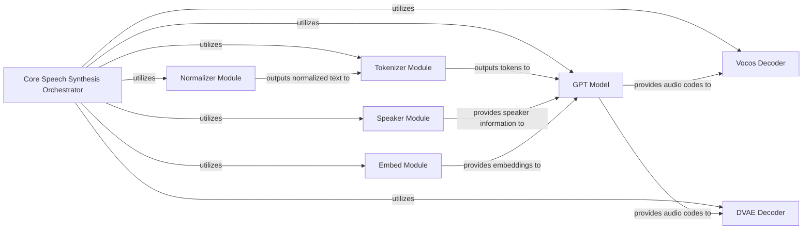

## Details

The ChatTTS system is designed around a modular architecture for speech synthesis, orchestrated by the `Core Speech Synthesis Orchestrator`. This central component manages the entire pipeline, from initial text processing and normalization through tokenization, to the generation of audio codes by the `GPT Model`. Speaker characteristics are integrated via the `Speaker Module` and various inputs are vectorized by the `Embed Module`. The generated audio codes are then transformed into audible waveforms by either the `Vocos Decoder` or the `DVAE Decoder`. This design emphasizes clear separation of concerns, allowing for independent development and potential interchangeability of components like the vocoders and text processing modules.

### Core Speech Synthesis Orchestrator [[Expand]](./Core_Speech_Synthesis_Orchestrator.md)
The central control unit responsible for orchestrating the entire speech synthesis pipeline, from model loading and configuration to text processing, audio code generation, and final audio decoding. It serves as the primary entry point for users interacting with the ChatTTS system.

**Related Classes/Methods**:

- <a href="git@github.com:2noise/ChatTTS.git/blob/main/temp/66139c40963e46aca2622f4704dac99e/ChatTTS/core.py#L32-L751" target="_blank" rel="noopener noreferrer">`ChatTTS.core.Chat`:32-751</a>

### GPT Model [[Expand]](./GPT_Model.md)
Handles text refinement and the generation of audio codes, forming the core generative part of the speech synthesis process.

**Related Classes/Methods**:

- <a href="git@github.com:2noise/ChatTTS.git/blob/main/temp/66139c40963e46aca2622f4704dac99e/ChatTTS/model/gpt.py" target="_blank" rel="noopener noreferrer">`ChatTTS.model.gpt`</a>

### Vocos Decoder
Decodes the generated audio codes into raw audio waveforms using the Vocos neural vocoder. While conceptually part of the ChatTTS model, its specific implementation details within the project's internal files are not directly identifiable, suggesting it might be an external dependency or integrated within other modules.

**Related Classes/Methods**:

### DVAE Decoder
Decodes the generated audio codes into raw audio waveforms using the DVAE model, serving as an alternative or complementary vocoder.

**Related Classes/Methods**:

- <a href="git@github.com:2noise/ChatTTS.git/blob/main/temp/66139c40963e46aca2622f4704dac99e/ChatTTS/model/dvae.py" target="_blank" rel="noopener noreferrer">`ChatTTS.model.dvae`</a>

### Normalizer Module
Performs text preprocessing and normalization (e.g., expanding abbreviations, handling numbers) to ensure consistent and clean input for subsequent stages.

**Related Classes/Methods**:

- <a href="git@github.com:2noise/ChatTTS.git/blob/main/temp/66139c40963e46aca2622f4704dac99e/ChatTTS/norm.py" target="_blank" rel="noopener noreferrer">`ChatTTS.norm`</a>

### Tokenizer Module
Converts the normalized text into numerical tokens, which are the required input format for the GPT Model.

**Related Classes/Methods**:

- <a href="git@github.com:2noise/ChatTTS.git/blob/main/temp/66139c40963e46aca2622f4704dac99e/ChatTTS/model/tokenizer.py" target="_blank" rel="noopener noreferrer">`ChatTTS.model.tokenizer`</a>

### Speaker Module
Manages speaker-related functionalities, including sampling and embedding speaker characteristics to control the voice style of the synthesized speech.

**Related Classes/Methods**:

- <a href="git@github.com:2noise/ChatTTS.git/blob/main/temp/66139c40963e46aca2622f4704dac99e/ChatTTS/model/speaker.py" target="_blank" rel="noopener noreferrer">`ChatTTS.model.speaker`</a>

### Embed Module
Handles embedding operations, converting various inputs (e.g., text tokens, speaker IDs) into dense vector representations that can be processed by neural networks.

**Related Classes/Methods**:

- <a href="git@github.com:2noise/ChatTTS.git/blob/main/temp/66139c40963e46aca2622f4704dac99e/ChatTTS/model/embed.py" target="_blank" rel="noopener noreferrer">`ChatTTS.model.embed`</a>

### [FAQ](https://github.com/CodeBoarding/GeneratedOnBoardings/tree/main?tab=readme-ov-file#faq)