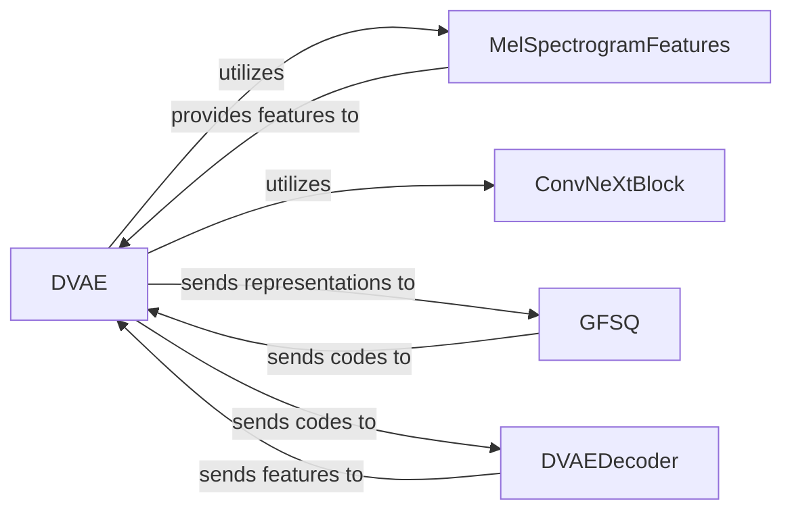

## Details

The DVAE subsystem is a core component within the ChatTTS project, designed for transforming latent codes into acoustic features. This pipeline ensures a structured transformation from initial features to reconstructed audio representations through a quantized latent space.

### DVAE [[Expand]](./DVAE.md)
The top-level orchestrator of the entire DVAE process. It acts as the primary entry point for DVAE operations, managing the flow between initial feature processing, quantization, and decoding stages. It initializes and holds instances of its sub-components, coordinating their execution to transform latent codes into acoustic features.

**Related Classes/Methods**:

- <a href="git@github.com:2noise/ChatTTS.git/blob/main/temp/66139c40963e46aca2622f4704dac99e/ChatTTS/model/dvae.py#L209-L303" target="_blank" rel="noopener noreferrer">`ChatTTS.model.dvae.DVAE`:209-303</a>

### MelSpectrogramFeatures
Handles the extraction or processing of Mel-spectrogram features, serving as the primary input representation for the DVAE. It prepares the raw audio or intermediate features into a format suitable for the DVAE's processing.

**Related Classes/Methods**:

- <a href="git@github.com:2noise/ChatTTS.git/blob/main/temp/66139c40963e46aca2622f4704dac99e/ChatTTS/model/dvae.py#L175-L206" target="_blank" rel="noopener noreferrer">`ChatTTS.model.dvae.MelSpectrogramFeatures`:175-206</a>

### ConvNeXtBlock
Provides a generic convolutional building block for feature transformation within the DVAE. It is utilized for various internal feature processing steps, enhancing the model's ability to learn complex representations.

**Related Classes/Methods**:

- <a href="git@github.com:2noise/ChatTTS.git/blob/main/temp/66139c40963e46aca2622f4704dac99e/ChatTTS/model/dvae.py#L14-L66" target="_blank" rel="noopener noreferrer">`ChatTTS.model.dvae.ConvNeXtBlock`:14-66</a>

### GFSQ
A core component responsible for converting continuous latent representations into discrete codes using Gumbel-Softmax Quantization. This is a fundamental step for learning discrete representations in the DVAE, enabling the model to work with a quantized latent space.

**Related Classes/Methods**:

- <a href="git@github.com:2noise/ChatTTS.git/blob/main/temp/66139c40963e46aca2622f4704dac99e/ChatTTS/model/dvae.py#L69-L128" target="_blank" rel="noopener noreferrer">`ChatTTS.model.dvae.GFSQ`:69-128</a>

### DVAEDecoder [[Expand]](./DVAEDecoder.md)
Takes the discrete latent codes generated by GFSQ and reconstructs them into acoustic features, typically Mel-spectrograms. This component is responsible for translating the quantized representations back into a continuous, audible form.

**Related Classes/Methods**:

- <a href="git@github.com:2noise/ChatTTS.git/blob/main/temp/66139c40963e46aca2622f4704dac99e/ChatTTS/model/dvae.py#L131-L172" target="_blank" rel="noopener noreferrer">`ChatTTS.model.dvae.DVAEDecoder`:131-172</a>

### [FAQ](https://github.com/CodeBoarding/GeneratedOnBoardings/tree/main?tab=readme-ov-file#faq)