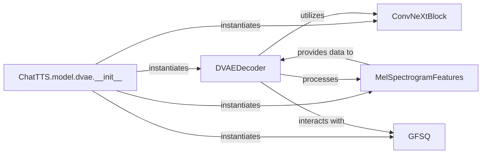

## Details

The `ChatTTS.model.dvae` subsystem implements a Discrete Variational Autoencoder (DVAE) designed for processing acoustic features, specifically Mel spectrograms. At its core, the `ChatTTS.model.dvae.__init__` method acts as the orchestrator, instantiating the key components: `DVAEDecoder`, `MelSpectrogramFeatures`, `ConvNeXtBlock`, and `GFSQ`. The `DVAEDecoder` is the central processing unit, responsible for both encoding Mel spectrograms into latent codes and decoding these codes back into acoustic features. It heavily relies on `ConvNeXtBlock` for its internal convolutional operations and interacts with `GFSQ` for the crucial quantization of features into a discrete latent space. `MelSpectrogramFeatures` serves as the data interface, ensuring that acoustic data is correctly formatted for processing by the `DVAEDecoder`. This structured interaction allows the DVAE to effectively learn and manipulate discrete representations of speech.

### DVAEDecoder [[Expand]](./DVAEDecoder.md)
The core neural network module responsible for transforming latent representations (codes) into acoustic features during the decoding phase. It can also optionally process Mel spectrograms into latent codes during an encoding phase. It serves as the computational engine of the DVAE.

**Related Classes/Methods**:

- <a href="git@github.com:2noise/ChatTTS.git/blob/main/temp/66139c40963e46aca2622f4704dac99e/ChatTTS/model/dvae.py#L131-L172" target="_blank" rel="noopener noreferrer">`DVAEDecoder`:131-172</a>

### ChatTTS.model.dvae.__init__
This serves as the subsystem's entry point and orchestrator. It is responsible for setting up the DVAE model architecture, loading configurations, and instantiating sub-modules, effectively composing the DVAE system by bringing together its constituent parts.

**Related Classes/Methods**:

- <a href="git@github.com:2noise/ChatTTS.git/blob/main/temp/66139c40963e46aca2622f4704dac99e/ChatTTS/model/dvae.py#L210-L243" target="_blank" rel="noopener noreferrer">`ChatTTS.model.dvae.__init__`:210-243</a>

### MelSpectrogramFeatures
A data processing component responsible for handling the acoustic feature representation (Mel spectrograms) that the DVAE operates on. It acts as an interface for input/output data, ensuring the DVAE processes data in the correct format.

**Related Classes/Methods**:

- <a href="git@github.com:2noise/ChatTTS.git/blob/main/temp/66139c40963e46aca2622f4704dac99e/ChatTTS/model/dvae.py#L175-L206" target="_blank" rel="noopener noreferrer">`MelSpectrogramFeatures`:175-206</a>

### ConvNeXtBlock
A foundational and reusable neural network building block. It provides the convolutional architecture for the DVAE's internal transformations, contributing to its feature extraction and generation capabilities.

**Related Classes/Methods**:

- <a href="git@github.com:2noise/ChatTTS.git/blob/main/temp/66139c40963e46aca2622f4704dac99e/ChatTTS/model/dvae.py#L14-L66" target="_blank" rel="noopener noreferrer">`ConvNeXtBlock`:14-66</a>

### GFSQ
A specialized component for quantizing features into a discrete latent space. This is essential for managing the latent codes, enabling the DVAE to operate on discrete representations.

**Related Classes/Methods**:

- <a href="git@github.com:2noise/ChatTTS.git/blob/main/temp/66139c40963e46aca2622f4704dac99e/ChatTTS/model/dvae.py#L69-L128" target="_blank" rel="noopener noreferrer">`GFSQ`:69-128</a>

### [FAQ](https://github.com/CodeBoarding/GeneratedOnBoardings/tree/main?tab=readme-ov-file#faq)