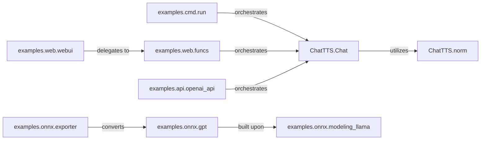

## Details

This subsystem provides interfaces and model export capabilities for the ChatTTS text-to-speech system, including command-line, web, and API interactions. It leverages the core ChatTTS inference engine and text normalization utilities. It also includes components for converting the ChatTTS GPT model into the ONNX format for optimized deployment. The core text-to-speech functionality is in `ChatTTS.Chat`, which uses `ChatTTS.norm` for text preprocessing. This core is exposed via `examples.cmd.run`, `examples.web.webui` (with `examples.web.funcs`), and `examples.api.openai_api`. For optimization, `examples.onnx.exporter` converts `examples.onnx.gpt` (based on `examples.onnx.modeling_llama`) to ONNX.

### ChatTTS.Chat
The central orchestrator for text-to-speech synthesis. It is responsible for loading models, managing speaker embeddings, performing the core inference process, and integrating text normalization.

**Related Classes/Methods**:

### ChatTTS.norm
Core utility for text processing and normalization, specifically the `Normalizer` class. It ensures input text is in a suitable format for the speech synthesis model by handling character mapping, homophone replacement, and language detection.

**Related Classes/Methods**:

- <a href="git@github.com:2noise/ChatTTS.git/blob/main/temp/61f936eb8766444da3d6592b4973b108/ChatTTS/norm.py" target="_blank" rel="noopener noreferrer">`ChatTTS.norm.Normalizer`</a>

### examples.cmd.run
Provides command-line access to ChatTTS functionalities, enabling text normalization, audio generation, and saving output files (e.g., MP3) by interacting with the `ChatTTS.Chat` core.

**Related Classes/Methods**:

- <a href="git@github.com:2noise/ChatTTS.git/blob/main/temp/61f936eb8766444da3d6592b4973b108/examples/cmd/run.py#L54-L106" target="_blank" rel="noopener noreferrer">`examples.cmd.run.main`:54-106</a>

### examples.web.webui
Initializes and manages the web-based graphical user interface for ChatTTS using Gradio, allowing interactive text-to-speech generation and configuration.

**Related Classes/Methods**:

- <a href="git@github.com:2noise/ChatTTS.git/blob/main/temp/61f936eb8766444da3d6592b4973b108/examples/web/webui.py#L17-L283" target="_blank" rel="noopener noreferrer">`examples.web.webui.main`:17-283</a>

### examples.web.funcs
Provides helper functions for the ChatTTS web UI, managing UI elements, chat state, and interactions. This includes functions for audio generation, text refinement, model loading/reloading, and speaker embedding sampling, all by interacting with the `ChatTTS.Chat` core.

**Related Classes/Methods**:

- <a href="git@github.com:2noise/ChatTTS.git/blob/main/temp/61f936eb8766444da3d6592b4973b108/examples/web/funcs.py#L164-L209" target="_blank" rel="noopener noreferrer">`examples.web.funcs.generate_audio`:164-209</a>
- <a href="git@github.com:2noise/ChatTTS.git/blob/main/temp/61f936eb8766444da3d6592b4973b108/examples/web/funcs.py#L133-L161" target="_blank" rel="noopener noreferrer">`examples.web.funcs.refine_text`:133-161</a>
- <a href="git@github.com:2noise/ChatTTS.git/blob/main/temp/61f936eb8766444da3d6592b4973b108/examples/web/funcs.py#L65-L92" target="_blank" rel="noopener noreferrer">`examples.web.funcs.load_chat`:65-92</a>

### examples.api.openai_api
Exposes ChatTTS capabilities via a FastAPI-based RESTful API, compatible with OpenAI's API specifications. It handles voice generation requests and streams audio responses by interacting with the `ChatTTS.Chat` core.

**Related Classes/Methods**:

- <a href="git@github.com:2noise/ChatTTS.git/blob/main/temp/61f936eb8766444da3d6592b4973b108/examples/api/openai_api.py#L106-L135" target="_blank" rel="noopener noreferrer">`examples.api.openai_api.OpenAITTSRequest`:106-135</a>
- <a href="git@github.com:2noise/ChatTTS.git/blob/main/temp/61f936eb8766444da3d6592b4973b108/examples/api/openai_api.py#L149-L279" target="_blank" rel="noopener noreferrer">`examples.api.openai_api.generate_voice`:149-279</a>

### examples.onnx.exporter
Facilitates the conversion of the ChatTTS GPT model (which is based on a Llama architecture) into the ONNX (Open Neural Network Exchange) format, enabling optimized deployment and inference.

**Related Classes/Methods**:

- <a href="git@github.com:2noise/ChatTTS.git/blob/main/temp/61f936eb8766444da3d6592b4973b108/examples/onnx/exporter.py#L40-L346" target="_blank" rel="noopener noreferrer">`examples.onnx.exporter.export_gpt`:40-346</a>

### examples.onnx.gpt
Defines and structures the GPT model components specifically tailored for ONNX export. This model internally utilizes a Llama-based architecture (`modeling_llama.LlamaModel`) for its core transformer layers.

**Related Classes/Methods**:

- <a href="git@github.com:2noise/ChatTTS.git/blob/main/temp/61f936eb8766444da3d6592b4973b108/examples/onnx/gpt.py" target="_blank" rel="noopener noreferrer">`examples.onnx.gpt.GPT`</a>

### examples.onnx.modeling_llama
Provides the foundational Llama model architecture components, such as `LlamaModel`, `LlamaRMSNorm`, and `LlamaRotaryEmbedding`, which are used by the ChatTTS GPT model for its transformer layers.

**Related Classes/Methods**:

- <a href="git@github.com:2noise/ChatTTS.git/blob/main/temp/61f936eb8766444da3d6592b4973b108/examples/onnx/modeling_llama.py#L684-L898" target="_blank" rel="noopener noreferrer">`examples.onnx.modeling_llama.LlamaModel`:684-898</a>
- <a href="git@github.com:2noise/ChatTTS.git/blob/main/temp/61f936eb8766444da3d6592b4973b108/examples/onnx/modeling_llama.py" target="_blank" rel="noopener noreferrer">`examples.onnx.modeling_llama.LlamaConfig`</a>

### [FAQ](https://github.com/CodeBoarding/GeneratedOnBoardings/tree/main?tab=readme-ov-file#faq)