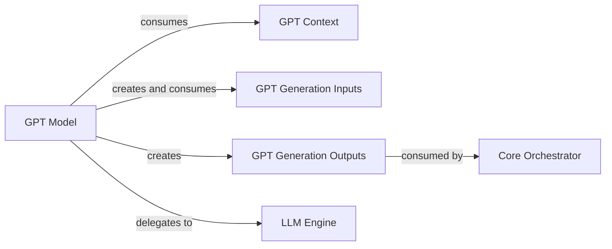

## Details

The `ChatTTS.model.gpt` subsystem is centered around the `GPT Model`, which is responsible for the core text generation process. It relies on `GPT Context` for configuration and `GPT Generation Inputs` for structured input data. The model produces `GPT Generation Outputs`, which are then consumed by a higher-level `Core Orchestrator` for further processing. The `GPT Model` delegates its low-level language model operations to the `LLM Engine`, which handles the actual execution of the large language model.

### GPT Model [[Expand]](./GPT_Model.md)
The central component representing the GPT model itself. It encapsulates the model's architecture, manages its lifecycle (initialization, loading), and orchestrates the text generation process. It is responsible for configuring the model, preparing inputs and outputs, and executing the core generation logic.

**Related Classes/Methods**:

- <a href="git@github.com:2noise/ChatTTS.git/blob/main/temp/66139c40963e46aca2622f4704dac99e/ChatTTS/model/gpt.py" target="_blank" rel="noopener noreferrer">`ChatTTS.model.gpt.GPT`</a>

### GPT Context
A structured data container for configuration parameters and contextual information required by the `GPT Model`. It provides the necessary settings for the model's operation.

**Related Classes/Methods**:

- <a href="git@github.com:2noise/ChatTTS.git/blob/main/temp/66139c40963e46aca2622f4704dac99e/ChatTTS/model/gpt.py" target="_blank" rel="noopener noreferrer">`ChatTTS.model.gpt.Context`</a>

### GPT Generation Inputs
A structured data container specifically designed to hold the input data required by the `GPT Model` for its text generation process. This ensures a standardized input format.

**Related Classes/Methods**:

- <a href="git@github.com:2noise/ChatTTS.git/blob/main/temp/66139c40963e46aca2622f4704dac99e/ChatTTS/model/gpt.py#L141-L159" target="_blank" rel="noopener noreferrer">`ChatTTS.model.gpt._GenerationInputs`:141-159</a>

### GPT Generation Outputs
A structured data container for the results produced by the `GPT Model` after a text generation operation. It encapsulates the generated text and any associated metadata.

**Related Classes/Methods**:

- <a href="git@github.com:2noise/ChatTTS.git/blob/main/temp/66139c40963e46aca2622f4704dac99e/ChatTTS/model/gpt.py#L276-L285" target="_blank" rel="noopener noreferrer">`ChatTTS.model.gpt.GenerationOutputs`:276-285</a>

### LLM Engine
This component is responsible for the low-level execution of the large language model operations. It acts as the underlying engine that the `GPT Model` delegates to for performing the actual computations and generation tasks.

**Related Classes/Methods**:

- <a href="git@github.com:2noise/ChatTTS.git/blob/main/temp/66139c40963e46aca2622f4704dac99e/ChatTTS/model/velocity/llm_engine.py#L38-L833" target="_blank" rel="noopener noreferrer">`ChatTTS.model.velocity.llm_engine.LLMEngine`:38-833</a>

### Core Orchestrator [[Expand]](./Core_Orchestrator.md)
A higher-level component that consumes the `GPT Generation Outputs` for further processing. While not directly part of the `ChatTTS.model.gpt` subsystem, it represents the external entity that utilizes the generated text, potentially for tasks like speech synthesis or integration into a larger application flow.

**Related Classes/Methods**: _None_

### [FAQ](https://github.com/CodeBoarding/GeneratedOnBoardings/tree/main?tab=readme-ov-file#faq)