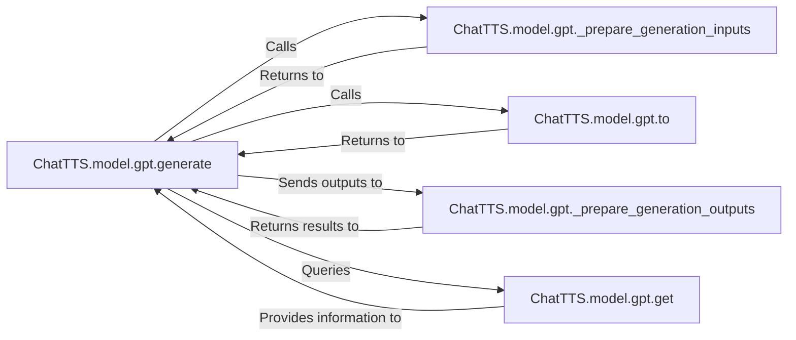

## Details

The `Generation Logic` subsystem within `ChatTTS` is primarily encapsulated by the `ChatTTS.model.gpt` module, specifically centered around the `generate` method. This subsystem is responsible for the end-to-end process of transforming structured inputs into structured outputs, forming the core of the text-to-code generation pipeline.

### ChatTTS.model.gpt.generate
The orchestrator of the entire text-to-code generation lifecycle. It manages the sequence of operations, including input preparation, setting up the execution environment, executing the core generation loop, and processing raw outputs into a final, usable format. It acts as the central control flow for the generation process.

**Related Classes/Methods**:

- <a href="git@github.com:2noise/ChatTTS.git/blob/main/temp/66139c40963e46aca2622f4704dac99e/ChatTTS/model/gpt.py#L315-L618" target="_blank" rel="noopener noreferrer">`ChatTTS.model.gpt.generate`:315-618</a>

### ChatTTS.model.gpt._prepare_generation_inputs
Transforms raw input data (e.g., text prompts, parameters) into the specific structured format (e.g., tokenized tensors, attention masks) required by the GPT model for efficient processing. This component is crucial for the initial stage of the inference pipeline.

**Related Classes/Methods**:

- <a href="git@github.com:2noise/ChatTTS.git/blob/main/temp/66139c40963e46aca2622f4704dac99e/ChatTTS/model/gpt.py#L161-L274" target="_blank" rel="noopener noreferrer">`ChatTTS.model.gpt._prepare_generation_inputs`:161-274</a>

### ChatTTS.model.gpt.to
Configures the computational environment for the GPT model. This involves moving the model and its associated data to the appropriate hardware device (CPU/GPU) and converting data types (e.g., to `bfloat16` for performance) to optimize execution. This is vital for performance and resource management.

**Related Classes/Methods**:

- <a href="git@github.com:2noise/ChatTTS.git/blob/main/temp/66139c40963e46aca2622f4704dac99e/ChatTTS/model/gpt.py#L151-L159" target="_blank" rel="noopener noreferrer">`ChatTTS.model.gpt.to`:151-159</a>

### ChatTTS.model.gpt._prepare_generation_outputs
Processes the raw outputs generated by the GPT model (e.g., token IDs, logits) into a user-friendly, structured format. This might involve decoding tokens back into text, structuring data objects, or applying post-processing steps, completing the inference pipeline.

**Related Classes/Methods**:

- <a href="git@github.com:2noise/ChatTTS.git/blob/main/temp/66139c40963e46aca2622f4704dac99e/ChatTTS/model/gpt.py#L287-L313" target="_blank" rel="noopener noreferrer">`ChatTTS.model.gpt._prepare_generation_outputs`:287-313</a>

### ChatTTS.model.gpt.get
Retrieves specific internal states, configurations, or intermediate results from the GPT model. This could be used for debugging, monitoring, or dynamic adjustments during the generation process, supporting the overall control flow.

**Related Classes/Methods**:

- <a href="git@github.com:2noise/ChatTTS.git/blob/main/temp/66139c40963e46aca2622f4704dac99e/ChatTTS/model/gpt.py#L110-L111" target="_blank" rel="noopener noreferrer">`ChatTTS.model.gpt.get`:110-111</a>

### [FAQ](https://github.com/CodeBoarding/GeneratedOnBoardings/tree/main?tab=readme-ov-file#faq)