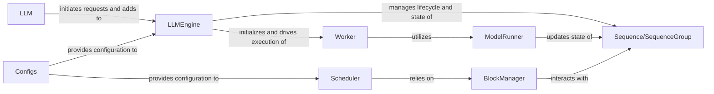

## Details

The Inference Optimization Engine subsystem is a high-performance backend designed to optimize the execution of large language models, focusing on GPU memory management, batching, and request scheduling for efficient throughput.

### LLM
Serves as the public API for initiating and managing LLM generation requests, abstracting the underlying complexities of the inference engine. It acts as the primary interface for external interaction with the optimization engine.

**Related Classes/Methods**:

- <a href="git@github.com:2noise/ChatTTS.git/blob/main/temp/61f936eb8766444da3d6592b4973b108/ChatTTS/model/velocity/llm.py" target="_blank" rel="noopener noreferrer">`ChatTTS/model/velocity/llm.py`</a>

### LLMEngine
The core orchestrator of the entire inference process. It manages the lifecycle of incoming requests, dispatches them to available workers, and coordinates with the scheduler and block manager for resource allocation. It also oversees the state of active generation sequences.

**Related Classes/Methods**:

- <a href="git@github.com:2noise/ChatTTS.git/blob/main/temp/61f936eb8766444da3d6592b4973b108/ChatTTS/model/velocity/llm_engine.py" target="_blank" rel="noopener noreferrer">`ChatTTS/model/velocity/llm_engine.py`</a>

### Worker
Executes the actual LLM inference on a specific device (e.g., GPU). It handles model loading and setup within a distributed environment, performing the computational heavy lifting.

**Related Classes/Methods**:

- <a href="git@github.com:2noise/ChatTTS.git/blob/main/temp/61f936eb8766444da3d6592b4973b108/ChatTTS/model/velocity/worker.py" target="_blank" rel="noopener noreferrer">`ChatTTS/model/velocity/worker.py`</a>

### ModelRunner
Encapsulates the core logic for running the language model's forward pass. It prepares inputs, executes the model, and processes outputs, interacting with sequence objects to update their states.

**Related Classes/Methods**:

- <a href="git@github.com:2noise/ChatTTS.git/blob/main/temp/61f936eb8766444da3d6592b4973b108/ChatTTS/model/velocity/model_runner.py" target="_blank" rel="noopener noreferrer">`ChatTTS.model.velocity.model_runner.py`</a>

### Scheduler
Manages the scheduling of sequences on the GPU, including dynamic memory allocation for KV cache and preemption strategies to optimize throughput and latency.

**Related Classes/Methods**:

- <a href="git@github.com:2noise/ChatTTS.git/blob/main/temp/61f936eb8766444da3d6592b4973b108/ChatTTS/model/velocity/scheduler.py" target="_blank" rel="noopener noreferrer">`ChatTTS/model/velocity/scheduler.py`</a>

### BlockManager
Manages the allocation and deallocation of physical memory blocks (e.g., for KV cache) on both GPU and CPU, ensuring efficient memory utilization during inference.

**Related Classes/Methods**:

- <a href="git@github.com:2noise/ChatTTS.git/blob/main/temp/61f936eb8766444da3d6592b4973b108/ChatTTS/model/velocity/block_manager.py" target="_blank" rel="noopener noreferrer">`ChatTTS/model/velocity/block_manager.py`</a>

### Sequence/SequenceGroup
Represents and manages the state of individual generation sequences and groups of sequences. They store token IDs, lengths, attention masks, and other inference-related data, serving as the primary data structures for ongoing generations.

**Related Classes/Methods**:

- <a href="git@github.com:2noise/ChatTTS.git/blob/main/temp/61f936eb8766444da3d6592b4973b108/ChatTTS/model/velocity/sequence.py" target="_blank" rel="noopener noreferrer">`ChatTTS/model/velocity/sequence.py`</a>

### Configs
Handles the configuration of the entire inference engine. It provides parameters for model loading, cache settings, scheduler behavior, and parallelization strategies.

**Related Classes/Methods**:

- <a href="git@github.com:2noise/ChatTTS.git/blob/main/temp/61f936eb8766444da3d6592b4973b108/ChatTTS/model/velocity/configs.py" target="_blank" rel="noopener noreferrer">`ChatTTS/model/velocity/configs.py`</a>

### [FAQ](https://github.com/CodeBoarding/GeneratedOnBoardings/tree/main?tab=readme-ov-file#faq)