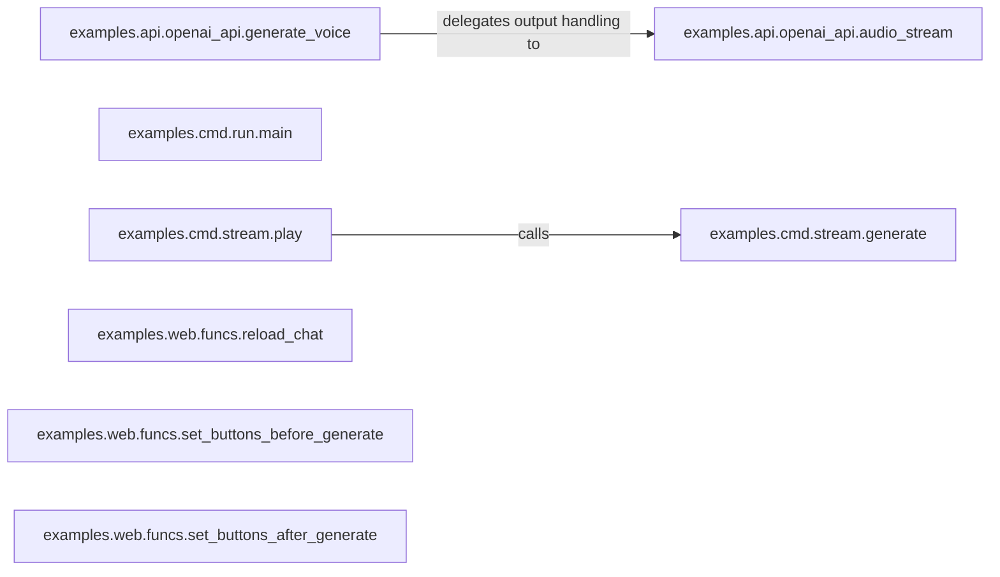

## Details

The ChatTTS project's core functionality revolves around text-to-speech (TTS) generation, accessible via both an OpenAI-compatible API and a command-line interface (CLI), with a web-based UI for interactive use. The architecture is designed to handle various audio generation and streaming scenarios, ensuring efficient processing and delivery of synthesized speech.

### examples.api.openai_api.generate_voice [[Expand]](./examples_api_openai_api_generate_voice.md)
Serves as the main entry point for all OpenAI-compatible Text-to-Speech (TTS) API requests. It validates input parameters, orchestrates audio format conversion, and manages the streaming of generated audio back to the client.

**Related Classes/Methods**:

- <a href="git@github.com:2noise/ChatTTS.git/blob/main/temp/66139c40963e46aca2622f4704dac99e/examples/api/openai_api.py#L240-L250" target="_blank" rel="noopener noreferrer">`examples.api.openai_api.convert_audio`:240-250</a>
- <a href="git@github.com:2noise/ChatTTS.git/blob/main/temp/66139c40963e46aca2622f4704dac99e/examples/api/openai_api.py#L256-L262" target="_blank" rel="noopener noreferrer">`examples.api.openai_api.audio_stream`:256-262</a>

### examples.api.openai_api.audio_stream
Manages the efficient streaming of generated audio data over the API. It iterates through generated WAV chunks and yields them, optionally including a WAV header for proper audio playback, ensuring a smooth and responsive experience for API consumers.

**Related Classes/Methods**:

- <a href="git@github.com:2noise/ChatTTS.git/blob/main/temp/66139c40963e46aca2622f4704dac99e/examples/api/openai_api.py#L256-L262" target="_blank" rel="noopener noreferrer">`examples.api.openai_api.audio_stream`:256-262</a>

### examples.cmd.run.main [[Expand]](./examples_cmd_run_main.md)
The primary entry point for batch text-to-speech tasks executed via the command-line interface. It initializes and loads the ChatTTS model, samples a speaker, performs audio inference from input texts, and saves the generated audio output to specified files. It also supports streaming output.

**Related Classes/Methods**:

- <a href="git@github.com:2noise/ChatTTS.git/blob/main/temp/66139c40963e46aca2622f4704dac99e/examples/cmd/run.py#L54-L106" target="_blank" rel="noopener noreferrer">`examples.cmd.run.main`:54-106</a>

### examples.cmd.stream.generate [[Expand]](./examples_cmd_stream_generate.md)
Implements the core logic for generating and formatting audio in a streaming fashion specifically for the CLI, enabling real-time playback or processing.

**Related Classes/Methods**:

- <a href="git@github.com:2noise/ChatTTS.git/blob/main/temp/66139c40963e46aca2622f4704dac99e/examples/cmd/stream.py#L50-L56" target="_blank" rel="noopener noreferrer">`examples.cmd.stream.formatted`:50-56</a>

### examples.cmd.stream.play
Initiates the audio streaming and playback process within the CLI environment, providing immediate auditory feedback to the user.

**Related Classes/Methods**:

- <a href="git@github.com:2noise/ChatTTS.git/blob/main/temp/66139c40963e46aca2622f4704dac99e/examples/cmd/stream.py#L74-L145" target="_blank" rel="noopener noreferrer">`examples.cmd.stream.generate`:74-145</a>

### examples.web.funcs.reload_chat
Manages the reloading of chat-related data and state within the WebUI. This involves unloading and reloading the ChatTTS model, handling DVAE coefficients, and ensuring the interface remains responsive and up-to-date during user interactions, with a check to prevent reloading during active generation.

**Related Classes/Methods**:

- <a href="git@github.com:2noise/ChatTTS.git/blob/main/temp/66139c40963e46aca2622f4704dac99e/examples/web/funcs.py#L95-L115" target="_blank" rel="noopener noreferrer">`examples.web.funcs.reload_chat`:95-115</a>

### examples.web.funcs.set_buttons_before_generate
Controls the visual state of UI buttons in the web interface, typically disabling or changing their appearance, before an audio generation process begins to prevent redundant actions.

**Related Classes/Methods**:

- <a href="git@github.com:2noise/ChatTTS.git/blob/main/temp/66139c40963e46aca2622f4704dac99e/examples/web/funcs.py#L127-L130" target="_blank" rel="noopener noreferrer">`examples.web.funcs._set_generate_buttons`:127-130</a>

### examples.web.funcs.set_buttons_after_generate
Controls the visual state of UI buttons in the web interface, typically re-enabling them or changing their appearance, after an audio generation process completes, indicating readiness for new input.

**Related Classes/Methods**:

- <a href="git@github.com:2noise/ChatTTS.git/blob/main/temp/66139c40963e46aca2622f4704dac99e/examples/web/funcs.py#L127-L130" target="_blank" rel="noopener noreferrer">`examples.web.funcs._set_generate_buttons`:127-130</a>

### [FAQ](https://github.com/CodeBoarding/GeneratedOnBoardings/tree/main?tab=readme-ov-file#faq)