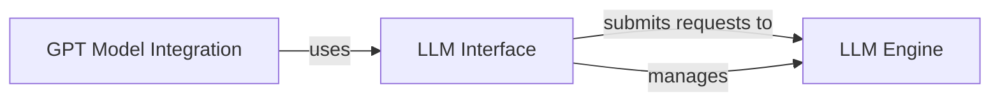

## Details

The `LLM Interface` subsystem is a critical part of the `ChatTTS` project, specifically designed to manage and abstract interactions with Large Language Models (LLMs). It serves as the primary API layer for LLM functionalities, enabling other components to seamlessly integrate and utilize LLMs without dealing with their underlying complexities.

### LLM Interface [[Expand]](./LLM_Interface.md)
This component, represented by `ChatTTS.model.velocity.llm.LLM`, serves as the high-level interface and facade for managing and interacting with Large Language Models (LLMs). It abstracts the complexities of the underlying LLM execution engine, providing a simplified API for model loading, configuration, and inference request submission.

**Related Classes/Methods**:

- <a href="git@github.com:2noise/ChatTTS.git/blob/main/temp/66139c40963e46aca2622f4704dac99e/ChatTTS/model/velocity/llm.py#L13-L213" target="_blank" rel="noopener noreferrer">`ChatTTS.model.velocity.llm.LLM`:13-213</a>
- <a href="git@github.com:2noise/ChatTTS.git/blob/main/temp/66139c40963e46aca2622f4704dac99e/ChatTTS/model/velocity/llm.py" target="_blank" rel="noopener noreferrer">`ChatTTS.model.velocity.llm.LLM:load_pretrained`</a>

### LLM Engine
This component, implicitly `ChatTTS.model.velocity.llm_engine.LLMEngine`, is the underlying execution engine responsible for the actual loading, running, and management of Large Language Models. It performs the low-level operations that are abstracted by the `LLM Interface`.

**Related Classes/Methods**:

- <a href="git@github.com:2noise/ChatTTS.git/blob/main/temp/66139c40963e46aca2622f4704dac99e/ChatTTS/model/velocity/llm_engine.py#L38-L833" target="_blank" rel="noopener noreferrer">`ChatTTS.model.velocity.llm_engine.LLMEngine`:38-833</a>

### GPT Model Integration
This component, part of `ChatTTS.model.gpt`, is responsible for initializing and utilizing the `LLM Interface` to integrate LLM capabilities into the broader GPT model context, specifically through its `load_pretrained` method.

**Related Classes/Methods**:

- <a href="git@github.com:2noise/ChatTTS.git/blob/main/temp/66139c40963e46aca2622f4704dac99e/ChatTTS/model/gpt.py" target="_blank" rel="noopener noreferrer">`ChatTTS.model.gpt`</a>
- <a href="git@github.com:2noise/ChatTTS.git/blob/main/temp/66139c40963e46aca2622f4704dac99e/ChatTTS/model/gpt.py" target="_blank" rel="noopener noreferrer">`ChatTTS.model.gpt:load_pretrained`</a>

### [FAQ](https://github.com/CodeBoarding/GeneratedOnBoardings/tree/main?tab=readme-ov-file#faq)