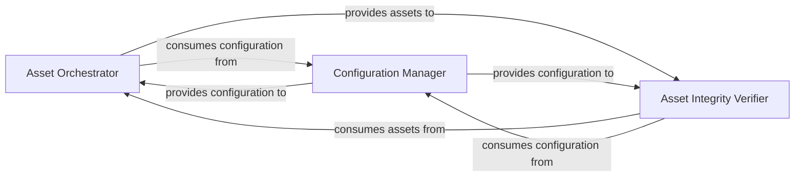

## Details

The Model & Asset Management subsystem is responsible for the complete lifecycle of model assets within the ChatTTS project. This includes the secure and reliable acquisition of model weights and configuration files from remote sources, their integrity verification, and the management of all associated configuration parameters. Its primary scope encompasses the ChatTTS.utils.dl and ChatTTS.config.config modules.

### Asset Orchestrator
This component is the primary entry point for asset acquisition. It orchestrates the download and extraction of all necessary model weights, configuration files, and other related assets from remote sources, ensuring all required components are in place before model loading.

**Related Classes/Methods**:

- <a href="git@github.com:2noise/ChatTTS.git/blob/main/temp/61f936eb8766444da3d6592b4973b108/ChatTTS/utils/dl.py" target="_blank" rel="noopener noreferrer">`ChatTTS.utils.dl:download_all_assets`</a>
- <a href="git@github.com:2noise/ChatTTS.git/blob/main/temp/61f936eb8766444da3d6592b4973b108/ChatTTS/utils/dl.py" target="_blank" rel="noopener noreferrer">`ChatTTS.utils.dl:download_and_extract_tar_gz`</a>
- <a href="git@github.com:2noise/ChatTTS.git/blob/main/temp/61f936eb8766444da3d6592b4973b108/ChatTTS/utils/dl.py" target="_blank" rel="noopener noreferrer">`ChatTTS.utils.dl:download_dns_yaml`</a>
- <a href="git@github.com:2noise/ChatTTS.git/blob/main/temp/61f936eb8766444da3d6592b4973b108/ChatTTS/utils/dl.py" target="_blank" rel="noopener noreferrer">`ChatTTS.utils.dl:download_and_extract_zip`</a>

### Asset Integrity Verifier
This component is responsible for ensuring the integrity and correctness of all downloaded model assets. It performs crucial checks to prevent the use of corrupted or incomplete files, which is vital for the reliability and stability of an ML system.

**Related Classes/Methods**:

- <a href="git@github.com:2noise/ChatTTS.git/blob/main/temp/61f936eb8766444da3d6592b4973b108/ChatTTS/utils/dl.py" target="_blank" rel="noopener noreferrer">`ChatTTS.utils.dl:check_all_assets`</a>
- <a href="git@github.com:2noise/ChatTTS.git/blob/main/temp/61f936eb8766444da3d6592b4973b108/ChatTTS/utils/dl.py" target="_blank" rel="noopener noreferrer">`ChatTTS.utils.dl:check_folder`</a>
- <a href="git@github.com:2noise/ChatTTS.git/blob/main/temp/61f936eb8766444da3d6592b4973b108/ChatTTS/utils/dl.py" target="_blank" rel="noopener noreferrer">`ChatTTS.utils.dl:check_model`</a>

### Configuration Manager
This component defines, stores, and provides all necessary configuration parameters that guide the asset management process. This includes critical information such as remote download URLs, expected file names, and integrity hashes (e.g., SHA256 checksums), essential for managing different model versions or deployment environments in an ML toolkit.

**Related Classes/Methods**:

- <a href="git@github.com:2noise/ChatTTS.git/blob/main/temp/61f936eb8766444da3d6592b4973b108/ChatTTS/config/config.py" target="_blank" rel="noopener noreferrer">`ChatTTS.config.config`</a>

### [FAQ](https://github.com/CodeBoarding/GeneratedOnBoardings/tree/main?tab=readme-ov-file#faq)