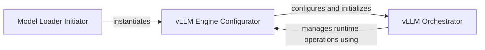

## Details

The ChatTTS model loading subsystem is designed to flexibly initialize the text-to-speech model, with a specialized path for vLLM integration. The `Model Loader Initiator` serves as the initial entry point, deciding between standard and vLLM-based loading. When vLLM is selected, the `vLLM Engine Configurator` takes charge, handling the detailed setup of the vLLM engine, including worker initialization and KV cache configuration. Once configured, the `vLLM Orchestrator` assumes control, managing the runtime execution, request scheduling, and overall inference flow of the vLLM-powered model. These vLLM components, while distinct in responsibility, are tightly integrated, primarily manifesting as different functional aspects of the central `LLMEngine` class.

### Model Loader Initiator
Serves as the primary entry point for loading pre-trained ChatTTS model weights and configurations. It abstracts the underlying complexities of model initialization, making crucial decisions based on the `is_vllm` flag and operating system to determine whether to use the vLLM-based loading path or a standard LlamaModel loading. It also handles experimental NVIDIA acceleration, ensuring the model is ready for inference.

**Related Classes/Methods**:

- <a href="git@github.com:2noise/ChatTTS.git/blob/main/temp/66139c40963e46aca2622f4704dac99e/ChatTTS/model/gpt.py#L59-L101" target="_blank" rel="noopener noreferrer">`ChatTTS.model.gpt.load_pretrained`:59-101</a>

### vLLM Engine Configurator
Handles the intricate, low-level details of the vLLM model's initialization and configuration. This includes validating configuration arguments, setting up computational workers (potentially for distributed processing using technologies like Ray), and configuring the model's cache for optimized inference performance. This component is critical for the operational readiness of the vLLM backend, primarily encapsulated within the `LLMEngine`'s setup methods.

**Related Classes/Methods**:

- <a href="git@github.com:2noise/ChatTTS.git/blob/main/temp/66139c40963e46aca2622f4704dac99e/ChatTTS/model/velocity/llm_engine.py" target="_blank" rel="noopener noreferrer">`ChatTTS.model.velocity.llm_engine.LLMEngine.__init__`</a>
- <a href="git@github.com:2noise/ChatTTS.git/blob/main/temp/66139c40963e46aca2622f4704dac99e/ChatTTS/model/velocity/llm_engine.py" target="_blank" rel="noopener noreferrer">`ChatTTS.model.velocity.llm_engine.LLMEngine.from_engine_args`</a>
- <a href="git@github.com:2noise/ChatTTS.git/blob/main/temp/66139c40963e46aca2622f4704dac99e/ChatTTS/model/velocity/llm_engine.py" target="_blank" rel="noopener noreferrer">`ChatTTS.model.velocity.llm_engine.LLMEngine._init_workers`</a>
- <a href="git@github.com:2noise/ChatTTS.git/blob/main/temp/66139c40963e46aca2622f4704dac99e/ChatTTS/model/velocity/llm_engine.py" target="_blank" rel="noopener noreferrer">`ChatTTS.model.velocity.llm_engine.LLMEngine._init_cache`</a>

### vLLM Orchestrator
Manages the overall runtime lifecycle of the Large Language Model instance when the vLLM backend is utilized. It acts as the primary interface for interacting with the vLLM engine, handling request submission, scheduling, and processing the generated outputs. This component represents the operational state and control flow of the configured vLLM engine.

**Related Classes/Methods**:

- <a href="git@github.com:2noise/ChatTTS.git/blob/main/temp/66139c40963e46aca2622f4704dac99e/ChatTTS/model/velocity/llm_engine.py" target="_blank" rel="noopener noreferrer">`ChatTTS.model.velocity.llm_engine.LLMEngine.step`</a>
- <a href="git@github.com:2noise/ChatTTS.git/blob/main/temp/66139c40963e46aca2622f4704dac99e/ChatTTS/model/velocity/llm_engine.py" target="_blank" rel="noopener noreferrer">`ChatTTS.model.velocity.llm_engine.LLMEngine.add_request`</a>
- <a href="git@github.com:2noise/ChatTTS.git/blob/main/temp/66139c40963e46aca2622f4704dac99e/ChatTTS/model/velocity/llm_engine.py" target="_blank" rel="noopener noreferrer">`ChatTTS.model.velocity.llm_engine.LLMEngine.abort_request`</a>

### [FAQ](https://github.com/CodeBoarding/GeneratedOnBoardings/tree/main?tab=readme-ov-file#faq)