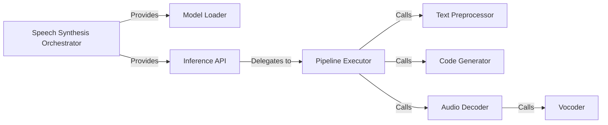

## Details

The Speech Synthesis Orchestrator subsystem is primarily encapsulated within the ChatTTS.core module, which serves as the central control unit for the entire text-to-speech pipeline. It coordinates data flow from text input to final audio output, managing interactions between all core synthesis modules.

### Speech Synthesis Orchestrator [[Expand]](./Speech_Synthesis_Orchestrator.md)
The main public API and state holder for the TTS system. It provides the overarching interface and manages the lifecycle of the synthesis process.

**Related Classes/Methods**:

- <a href="git@github.com:2noise/ChatTTS.git/blob/main/temp/61f936eb8766444da3d6592b4973b108/ChatTTS/core.py" target="_blank" rel="noopener noreferrer">`ChatTTS.core`</a>

### Model Loader
Manages the loading of all required models and assets, including the GPT and vocoder models, and their associated configurations.

**Related Classes/Methods**:

- <a href="git@github.com:2noise/ChatTTS.git/blob/main/temp/61f936eb8766444da3d6592b4973b108/ChatTTS/core.py#L137-L163" target="_blank" rel="noopener noreferrer">`ChatTTS.core.load`:137-163</a>

### Inference API
The primary user-facing method to initiate the text-to-speech process, serving as the public entry point for synthesis requests.

**Related Classes/Methods**:

- <a href="git@github.com:2noise/ChatTTS.git/blob/main/temp/61f936eb8766444da3d6592b4973b108/ChatTTS/core.py#L208-L270" target="_blank" rel="noopener noreferrer">`ChatTTS.core.infer`:208-270</a>

### Pipeline Executor
The core orchestrator of the speech synthesis pipeline. It coordinates the sequential flow of data and calls between various sub-components, from text refinement to audio decoding.

**Related Classes/Methods**:

- <a href="git@github.com:2noise/ChatTTS.git/blob/main/temp/61f936eb8766444da3d6592b4973b108/ChatTTS/core.py#L386-L503" target="_blank" rel="noopener noreferrer">`ChatTTS.core._infer`:386-503</a>

### Text Preprocessor
Responsible for preprocessing and refining the input text, preparing it for consumption by the GPT model. This includes tasks like tokenization or normalization.

**Related Classes/Methods**:

- <a href="git@github.com:2noise/ChatTTS.git/blob/main/temp/61f936eb8766444da3d6592b4973b108/ChatTTS/core.py#L664-L751" target="_blank" rel="noopener noreferrer">`ChatTTS.core._refine_text`:664-751</a>

### Code Generator
Generates intermediate audio codes from the refined text using the GPT model, forming the core of the speech synthesis process.

**Related Classes/Methods**:

- <a href="git@github.com:2noise/ChatTTS.git/blob/main/temp/61f936eb8766444da3d6592b4973b108/ChatTTS/core.py#L541-L662" target="_blank" rel="noopener noreferrer">`ChatTTS.core._infer_code`:541-662</a>

### Audio Decoder
Converts the generated intermediate audio codes into raw WAV audio data, acting as an intermediary step before final waveform generation.

**Related Classes/Methods**:

- <a href="git@github.com:2noise/ChatTTS.git/blob/main/temp/61f936eb8766444da3d6592b4973b108/ChatTTS/core.py#L512-L539" target="_blank" rel="noopener noreferrer">`ChatTTS.core._decode_to_wavs`:512-539</a>

### Vocoder
Performs the final conversion of audio codes into audible waveforms, utilizing a vocoder model to produce the final speech output.

**Related Classes/Methods**:

- <a href="git@github.com:2noise/ChatTTS.git/blob/main/temp/61f936eb8766444da3d6592b4973b108/ChatTTS/core.py#L505-L510" target="_blank" rel="noopener noreferrer">`ChatTTS.core._vocos_decode`:505-510</a>

### [FAQ](https://github.com/CodeBoarding/GeneratedOnBoardings/tree/main?tab=readme-ov-file#faq)