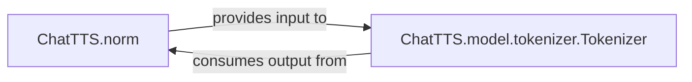

## Details

The `Text Preprocessing Module` subsystem is defined by its core responsibility: transforming raw input text into a format suitable for generative models. Its boundaries encompass components dedicated to text normalization, language detection, and tokenization.

### ChatTTS.norm
This component serves as the initial orchestrator for text preparation. It performs various normalization tasks on raw input text, including language detection, character mapping (e.g., half-width to full-width conversion), homophone mapping, and the splitting and combining of specific tags within the text. Its primary goal is to standardize and clean the text, ensuring consistency and handling language-specific nuances before it proceeds to tokenization.

**Related Classes/Methods**:

- <a href="git@github.com:2noise/ChatTTS.git/blob/main/temp/61f936eb8766444da3d6592b4973b108/ChatTTS/norm.py" target="_blank" rel="noopener noreferrer">`ChatTTS.norm`</a>

### ChatTTS.model.tokenizer.Tokenizer
This component is responsible for converting the normalized text (output from `ChatTTS.norm`) into a numerical format (token IDs) that can be directly processed by the generative models. Conversely, it also handles the decoding of model outputs (token IDs) back into human-readable text. It leverages pre-trained tokenization models to perform these conversions efficiently.

**Related Classes/Methods**:

- <a href="git@github.com:2noise/ChatTTS.git/blob/main/temp/61f936eb8766444da3d6592b4973b108/ChatTTS/model/tokenizer.py" target="_blank" rel="noopener noreferrer">`ChatTTS.model.tokenizer.Tokenizer`</a>

### [FAQ](https://github.com/CodeBoarding/GeneratedOnBoardings/tree/main?tab=readme-ov-file#faq)