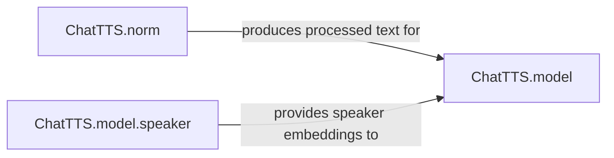

## Details

The ChatTTS architecture is designed for efficient text-to-speech synthesis, centered around three primary components. The `ChatTTS.norm` component handles the initial text normalization, ensuring that input text is consistently formatted and ready for synthesis. Simultaneously, the `ChatTTS.model.speaker` component manages the generation and application of speaker embeddings, which are crucial for defining the unique voice characteristics of the output. These preprocessed text and speaker embeddings converge at the `ChatTTS.model`, the core synthesis engine, which integrates these inputs to produce high-quality, natural-sounding speech. This modular design allows for clear separation of concerns, facilitating robust and scalable speech generation.

### ChatTTS.norm [[Expand]](./ChatTTS_norm.md)
This component standardizes raw text input for the speech synthesis model. Its responsibilities include character mapping, tag manipulation, homophone replacement, and language detection. It ensures data consistency and quality, making the text suitable for subsequent processing by the core synthesis model.

**Related Classes/Methods**:

- <a href="git@github.com:2noise/ChatTTS.git/blob/main/temp/66139c40963e46aca2622f4704dac99e/ChatTTS/norm.py" target="_blank" rel="noopener noreferrer">`ChatTTS.norm`</a>

### ChatTTS.model.speaker
This component manages the generation, encoding, and application of speaker-specific characteristics, represented as embeddings. It provides functionalities to sample new random speaker embeddings or apply pre-existing ones, which are essential for controlling voice attributes and generating diverse speech outputs.

**Related Classes/Methods**:

- <a href="git@github.com:2noise/ChatTTS.git/blob/main/temp/66139c40963e46aca2622f4704dac99e/ChatTTS/model/speaker.py" target="_blank" rel="noopener noreferrer">`ChatTTS.model.speaker`</a>

### ChatTTS.model [[Expand]](./ChatTTS_model.md)
This component represents the central speech synthesis engine of the ChatTTS system. It takes processed text from `ChatTTS.norm` and speaker embeddings from `ChatTTS.model.speaker` to generate high-quality, natural-sounding speech. Its primary responsibility is the transformation of linguistic and speaker-specific features into audible waveforms.

**Related Classes/Methods**:

- <a href="git@github.com:2noise/ChatTTS.git/blob/main/temp/66139c40963e46aca2622f4704dac99e/ChatTTS/model" target="_blank" rel="noopener noreferrer">`ChatTTS.model`</a>

### [FAQ](https://github.com/CodeBoarding/GeneratedOnBoardings/tree/main?tab=readme-ov-file#faq)