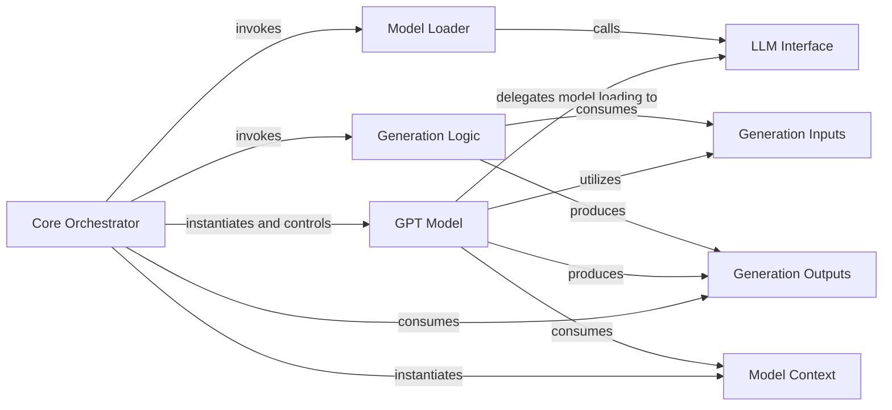

## Details

The `Text-to-Code Generation (GPT)` subsystem is a core part of the `ChatTTS` project, responsible for transforming normalized text into an intermediate code representation. This aligns with the project's `ML Toolkit/Library` type, where the emphasis is on the core ML model and its inference pipeline.

### GPT Model [[Expand]](./GPT_Model.md)
The central component representing the GPT model itself. It encapsulates the model's architecture, manages its lifecycle (initialization, loading), and orchestrates the text-to-code generation process.

**Related Classes/Methods**:

- <a href="git@github.com:2noise/ChatTTS.git/blob/main/temp/66139c40963e46aca2622f4704dac99e/ChatTTS/model/gpt.py" target="_blank" rel="noopener noreferrer">`ChatTTS.model.gpt.GPT`</a>

### Generation Logic [[Expand]](./Generation_Logic.md)
The primary method within the GPT model responsible for executing the core text-to-code generation logic. It takes structured inputs and produces structured outputs.

**Related Classes/Methods**:

- <a href="git@github.com:2noise/ChatTTS.git/blob/main/temp/66139c40963e46aca2622f4704dac99e/ChatTTS/model/gpt.py#L315-L618" target="_blank" rel="noopener noreferrer">`ChatTTS.model.gpt.generate`:315-618</a>

### Model Loader [[Expand]](./Model_Loader.md)
Handles the loading of pre-trained weights and configurations into the `GPT` model instance, making it ready for inference. This is crucial for model readiness and performance.

**Related Classes/Methods**:

- <a href="git@github.com:2noise/ChatTTS.git/blob/main/temp/66139c40963e46aca2622f4704dac99e/ChatTTS/model/gpt.py#L59-L101" target="_blank" rel="noopener noreferrer">`ChatTTS.model.gpt.load_pretrained`:59-101</a>

### LLM Interface [[Expand]](./LLM_Interface.md)
Provides a foundational interface for managing and interacting with large language models. The `GPT` model's `load_pretrained` method relies on this interface for core model loading functionalities.

**Related Classes/Methods**:

- <a href="git@github.com:2noise/ChatTTS.git/blob/main/temp/66139c40963e46aca2622f4704dac99e/ChatTTS/model/velocity/llm.py#L13-L213" target="_blank" rel="noopener noreferrer">`ChatTTS.model.velocity.llm.LLM`:13-213</a>

### Generation Inputs
A data structure that strictly defines the input format required by the `GPT` model's generation process, ensuring data consistency and type safety.

**Related Classes/Methods**:

- <a href="git@github.com:2noise/ChatTTS.git/blob/main/temp/66139c40963e46aca2622f4704dac99e/ChatTTS/model/gpt.py#L141-L159" target="_blank" rel="noopener noreferrer">`ChatTTS.model.gpt._GenerationInputs`:141-159</a>

### Generation Outputs
A data structure that defines the standardized output format produced by the `GPT` model's generation process, facilitating downstream processing.

**Related Classes/Methods**:

- <a href="git@github.com:2noise/ChatTTS.git/blob/main/temp/66139c40963e46aca2622f4704dac99e/ChatTTS/model/gpt.py#L276-L285" target="_blank" rel="noopener noreferrer">`ChatTTS.model.gpt.GenerationOutputs`:276-285</a>

### Model Context
Provides configuration or contextual data necessary for the proper functioning and parameterization of the `GPT` component, influencing its behavior during generation.

**Related Classes/Methods**:

- <a href="git@github.com:2noise/ChatTTS.git/blob/main/temp/66139c40963e46aca2622f4704dac99e/ChatTTS/model/gpt.py" target="_blank" rel="noopener noreferrer">`ChatTTS.model.gpt.Context`</a>

### Core Orchestrator [[Expand]](./Core_Orchestrator.md)
An external component that acts as the primary orchestrator, instantiating the `GPT` model, invoking its loading and generation methods, and consuming its outputs as part of the broader speech synthesis pipeline.

**Related Classes/Methods**:

- <a href="git@github.com:2noise/ChatTTS.git/blob/main/temp/66139c40963e46aca2622f4704dac99e/ChatTTS/core.py" target="_blank" rel="noopener noreferrer">`ChatTTS.core`</a>

### [FAQ](https://github.com/CodeBoarding/GeneratedOnBoardings/tree/main?tab=readme-ov-file#faq)