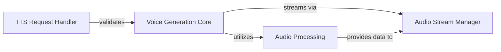

## Details

The `ChatTTS` core subsystem is designed to process text input and generate speech output, with a focus on OpenAI-compatible Text-to-Speech (TTS) API requests. The system orchestrates the entire text-to-speech pipeline, from validating incoming requests and managing model loading to generating and streaming audio. Its modular design separates concerns such as request handling, core voice generation, and audio processing, ensuring a clear and efficient flow for converting text into high-quality speech.

### TTS Request Handler
This component is responsible for defining the structure of incoming OpenAI-compatible TTS API requests and validating their parameters. It ensures that all input data conforms to the expected schema and types before further processing.

**Related Classes/Methods**:

- <a href="git@github.com:2noise/ChatTTS.git/blob/main/temp/66139c40963e46aca2622f4704dac99e/ChatTTS/core.py#L182-L194" target="_blank" rel="noopener noreferrer">`ChatTTS.core.Chat.RefineTextParams`:182-194</a>
- <a href="git@github.com:2noise/ChatTTS.git/blob/main/temp/66139c40963e46aca2622f4704dac99e/ChatTTS/core.py#L195-L207" target="_blank" rel="noopener noreferrer">`ChatTTS.core.Chat.InferCodeParams`:195-207</a>
- <a href="git@github.com:2noise/ChatTTS.git/blob/main/temp/66139c40963e46aca2622f4704dac99e/ChatTTS/core.py#L208-L270" target="_blank" rel="noopener noreferrer">`ChatTTS.core.Chat.infer`:208-270</a>

### Voice Generation Core
Serving as the central orchestrator, this component manages the entire text-to-speech process. It takes validated text input, interacts with underlying models (GPT, DVAE, Vocos), and coordinates the generation of speech audio.

**Related Classes/Methods**:

- <a href="git@github.com:2noise/ChatTTS.git/blob/main/temp/66139c40963e46aca2622f4704dac99e/ChatTTS/core.py#L208-L270" target="_blank" rel="noopener noreferrer">`ChatTTS.core.Chat.infer`:208-270</a>

### Audio Processing
This component handles the conversion and encoding of audio data. It is responsible for transforming the generated audio into the desired format (e.g., WAV) and preparing it for streaming, including the generation of necessary audio headers.

**Related Classes/Methods**:

- <a href="git@github.com:2noise/ChatTTS.git/blob/main/temp/66139c40963e46aca2622f4704dac99e/ChatTTS/core.py#L298-L299" target="_blank" rel="noopener noreferrer">`ChatTTS.core.Chat._load`:298-299</a>
- <a href="git@github.com:2noise/ChatTTS.git/blob/main/temp/66139c40963e46aca2622f4704dac99e/ChatTTS/core.py#L208-L270" target="_blank" rel="noopener noreferrer">`ChatTTS.core.Chat.infer`:208-270</a>

### Audio Stream Manager
This component is dedicated to managing the continuous streaming of generated audio back to the client. It ensures efficient data flow and proper handling of the streamed content.

**Related Classes/Methods**:

- <a href="git@github.com:2noise/ChatTTS.git/blob/main/temp/66139c40963e46aca2622f4704dac99e/ChatTTS/core.py#L211-L259" target="_blank" rel="noopener noreferrer">`ChatTTS.core.Chat.infer`:211-259</a>

### [FAQ](https://github.com/CodeBoarding/GeneratedOnBoardings/tree/main?tab=readme-ov-file#faq)