```mermaid
graph LR
    examples_cmd_run_main["examples.cmd.run.main"]
    ChatTTS_core["ChatTTS.core"]
    examples_cmd_run_load_normalizer["examples.cmd.run.load_normalizer"]
    examples_cmd_run_save_mp3_file["examples.cmd.run.save_mp3_file"]
    examples_cmd_run_main -- "calls" --> examples_cmd_run_load_normalizer
    examples_cmd_run_main -- "interacts with" --> ChatTTS_core
    examples_cmd_run_main -- "calls" --> examples_cmd_run_save_mp3_file
    click examples_cmd_run_main href "https://github.com/CodeBoarding/GeneratedOnBoardings/blob/main/ChatTTS/examples_cmd_run_main.md" "Details"
```

## Details

The `ChatTTS` project's command-line interface (CLI) subsystem is orchestrated by `examples.cmd.run.main`, which acts as the central control flow for text-to-speech operations. This component initiates the process by calling `examples.cmd.run.load_normalizer` to prepare input text for the core model. The normalized text is then passed to `ChatTTS.core` (represented by the `ChatTTS.Chat` class), which performs the actual speech synthesis. Finally, `examples.cmd.run.main` invokes `examples.cmd.run.save_mp3_file` to persist the generated audio. This architecture follows a clear pipeline pattern, separating concerns into distinct modules for input preparation, core processing, and output handling, all coordinated by a central orchestrator.

### examples.cmd.run.main [[Expand]](./examples_cmd_run_main.md)
The primary orchestrator for CLI-driven text-to-speech tasks. It manages the entire workflow, including initializing and loading the `ChatTTS` model, sampling speakers, performing audio inference from input texts, and directing the saving of generated audio. It embodies the "Pipeline/Workflow" pattern by coordinating the sequence of operations from text input to audio output.

**Related Classes/Methods**:

- <a href="git@github.com:2noise/ChatTTS.git/blob/main/temp/66139c40963e46aca2622f4704dac99e/examples/cmd/run.py#L54-L106" target="_blank" rel="noopener noreferrer">`examples.cmd.run.main`:54-106</a>

### ChatTTS.core
Represents the core speech synthesis model and its inference logic. This is the computational engine responsible for transforming preprocessed text into raw speech audio. It is central to the "Core Speech Synthesis Model/Engine" pattern, performing the primary ML task of the project.

**Related Classes/Methods**: _None_

### examples.cmd.run.load_normalizer
Responsible for loading and configuring text normalization components, likely from `ChatTTS.norm`. Its role is to preprocess input text, ensuring it is in a suitable format for the `ChatTTS.core` model. This aligns with the "Modular Design" pattern for data preparation, ensuring clean input for the core model.

**Related Classes/Methods**:

- <a href="git@github.com:2noise/ChatTTS.git/blob/main/temp/66139c40963e46aca2622f4704dac99e/examples/cmd/run.py#L32-L51" target="_blank" rel="noopener noreferrer">`examples.cmd.run.load_normalizer`:32-51</a>

### examples.cmd.run.save_mp3_file
Handles the persistence of generated audio data by saving it to a specified file path in MP3 format. This component encapsulates the audio encoding and file writing logic, representing a distinct output handling module.

**Related Classes/Methods**:

- <a href="git@github.com:2noise/ChatTTS.git/blob/main/temp/66139c40963e46aca2622f4704dac99e/examples/cmd/run.py#L24-L29" target="_blank" rel="noopener noreferrer">`examples.cmd.run.save_mp3_file`:24-29</a>

### [FAQ](https://github.com/CodeBoarding/GeneratedOnBoardings/tree/main?tab=readme-ov-file#faq)