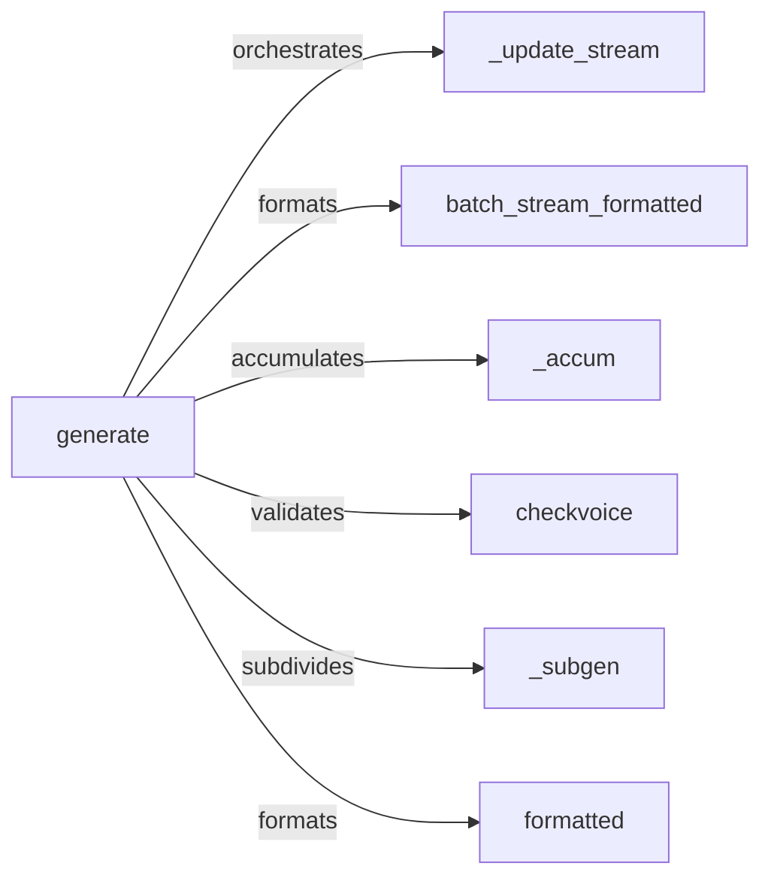

## Details

The streaming audio subsystem, encapsulated within the `ChatStreamer` class in `examples/cmd/stream.py`, is designed for efficient, continuous delivery of generated audio. At its core, the `generate` method orchestrates the entire streaming pipeline, processing incoming audio data from an external source. It leverages several internal helper methods: `_update_stream` for managing historical audio data and stream state, `batch_stream_formatted` for applying initial formatting to batched audio, and `_accum` for accumulating processed audio segments. Furthermore, `generate` utilizes `checkvoice` to validate audio content and `_subgen` to break down audio into manageable sub-generations. Finally, `formatted` applies the last-stage formatting to individual audio chunks before they are yielded, ensuring adherence to output specifications. This modular design facilitates a robust and flexible streaming mechanism for the CLI.

### generate [[Expand]](./generate.md)
Orchestrates the entire streaming audio generation workflow within the `ChatStreamer` class for the CLI. It acts as the central control flow, coordinating calls to other internal components to manage the process from input text (from `streamchat` generator) to streamed audio output. This aligns with an 'ML Toolkit/Library' pattern where a high-level function wraps the complex pipeline.

**Related Classes/Methods**:

- <a href="git@github.com:2noise/ChatTTS.git/blob/main/temp/66139c40963e46aca2622f4704dac99e/examples/cmd/stream.py#L74-L145" target="_blank" rel="noopener noreferrer">`ChatStreamer.generate`:74-145</a>

### _subgen
Responsible for breaking down the overall audio generation task into smaller, manageable sub-generations, yielding audio segments for further processing or output.

**Related Classes/Methods**:

- <a href="git@github.com:2noise/ChatTTS.git/blob/main/temp/66139c40963e46aca2622f4704dac99e/examples/cmd/stream.py#L67-L71" target="_blank" rel="noopener noreferrer">`ChatStreamer._subgen`:67-71</a>

### batch_stream_formatted
Manages the process of formatting batched audio data, converting it to the desired output format (e.g., PCM16_byte). This is an intermediate formatting step for efficient data transfer and processing.

**Related Classes/Methods**:

- <a href="git@github.com:2noise/ChatTTS.git/blob/main/temp/66139c40963e46aca2622f4704dac99e/examples/cmd/stream.py#L41-L47" target="_blank" rel="noopener noreferrer">`ChatStreamer.batch_stream_formatted`:41-47</a>

### formatted
Applies specific formatting requirements to individual generated audio data segments, ensuring they adhere to desired output specifications (e.g., sample rate, encoding) before yielding. This is a crucial final post-processing step for individual audio chunks.

**Related Classes/Methods**:

- <a href="git@github.com:2noise/ChatTTS.git/blob/main/temp/66139c40963e46aca2622f4704dac99e/examples/cmd/stream.py#L50-L56" target="_blank" rel="noopener noreferrer">`ChatStreamer.formatted`:50-56</a>

### _accum
Implements logic for accumulating or buffering audio segments, concatenating new stream data with previously processed data. This is critical for smooth, continuous streaming and for combining smaller generated parts into a cohesive stream before output.

**Related Classes/Methods**:

- <a href="git@github.com:2noise/ChatTTS.git/blob/main/temp/66139c40963e46aca2622f4704dac99e/examples/cmd/stream.py#L32-L38" target="_blank" rel="noopener noreferrer">`ChatStreamer._accum`:32-38</a>

### _update_stream
Responsible for updating the history of the audio stream, determining if enough data has been accumulated for processing, and managing the state of the stream for continuous delivery.

**Related Classes/Methods**:

- <a href="git@github.com:2noise/ChatTTS.git/blob/main/temp/66139c40963e46aca2622f4704dac99e/examples/cmd/stream.py#L14-L29" target="_blank" rel="noopener noreferrer">`ChatStreamer._update_stream`:14-29</a>

### checkvoice
Performs validation or checks on audio data segments to ensure they contain valid voice information (i.e., not silent), preventing the processing or output of empty audio.

**Related Classes/Methods**:

- <a href="git@github.com:2noise/ChatTTS.git/blob/main/temp/66139c40963e46aca2622f4704dac99e/examples/cmd/stream.py#L59-L64" target="_blank" rel="noopener noreferrer">`ChatStreamer.checkvoice`:59-64</a>

### [FAQ](https://github.com/CodeBoarding/GeneratedOnBoardings/tree/main?tab=readme-ov-file#faq)