```mermaid
graph LR
    Interface_Layer["Interface Layer"]
    Model_Asset_Management["Model & Asset Management"]
    Core_Speech_Synthesis_Orchestrator["Core Speech Synthesis Orchestrator"]
    Text_Preprocessing_Speaker_Embedding["Text Preprocessing & Speaker Embedding"]
    Text_to_Code_Generation_GPT_["Text-to-Code Generation (GPT)"]
    Code_to_Audio_Feature_Decoding_DVAE_["Code-to-Audio Feature Decoding (DVAE)"]
    Audio_Synthesis_Output["Audio Synthesis & Output"]
    Model_Export_Optimization["Model Export & Optimization"]
    Interface_Layer -- "sends Raw Text Input to" --> Core_Speech_Synthesis_Orchestrator
    Interface_Layer -- "requests Model Loading from" --> Model_Asset_Management
    Model_Asset_Management -- "provides Loaded Models/Assets to" --> Core_Speech_Synthesis_Orchestrator
    Core_Speech_Synthesis_Orchestrator -- "sends Raw Text for Normalization and requests Speaker Embeddings from" --> Text_Preprocessing_Speaker_Embedding
    Text_Preprocessing_Speaker_Embedding -- "returns Normalized Text and Speaker Embeddings to" --> Core_Speech_Synthesis_Orchestrator
    Core_Speech_Synthesis_Orchestrator -- "sends Normalized Text & Speaker Embeddings for Code Generation to" --> Text_to_Code_Generation_GPT_
    Text_to_Code_Generation_GPT_ -- "returns Generated Code to" --> Core_Speech_Synthesis_Orchestrator
    Core_Speech_Synthesis_Orchestrator -- "sends Code for Audio Feature Generation to" --> Code_to_Audio_Feature_Decoding_DVAE_
    Code_to_Audio_Feature_Decoding_DVAE_ -- "returns Acoustic Features to" --> Core_Speech_Synthesis_Orchestrator
    Core_Speech_Synthesis_Orchestrator -- "sends Acoustic Features for Audio Synthesis and Raw Audio for Formatting to" --> Audio_Synthesis_Output
    Audio_Synthesis_Output -- "returns Raw Audio (PCM) to" --> Core_Speech_Synthesis_Orchestrator
    Audio_Synthesis_Output -- "provides Formatted Audio Output to" --> Interface_Layer
    Text_to_Code_Generation_GPT_ -- "provides GPT Model for Export to" --> Model_Export_Optimization
    Model_Export_Optimization -- "exports Optimized Model to" --> Text_to_Code_Generation_GPT_
    click Interface_Layer href "https://github.com/CodeBoarding/GeneratedOnBoardings/blob/main/ChatTTS/Interface_Layer.md" "Details"
    click Core_Speech_Synthesis_Orchestrator href "https://github.com/CodeBoarding/GeneratedOnBoardings/blob/main/ChatTTS/Core_Speech_Synthesis_Orchestrator.md" "Details"
    click Text_Preprocessing_Speaker_Embedding href "https://github.com/CodeBoarding/GeneratedOnBoardings/blob/main/ChatTTS/Text_Preprocessing_Speaker_Embedding.md" "Details"
    click Text_to_Code_Generation_GPT_ href "https://github.com/CodeBoarding/GeneratedOnBoardings/blob/main/ChatTTS/Text_to_Code_Generation_GPT_.md" "Details"
    click Code_to_Audio_Feature_Decoding_DVAE_ href "https://github.com/CodeBoarding/GeneratedOnBoardings/blob/main/ChatTTS/Code_to_Audio_Feature_Decoding_DVAE_.md" "Details"
    click Audio_Synthesis_Output href "https://github.com/CodeBoarding/GeneratedOnBoardings/blob/main/ChatTTS/Audio_Synthesis_Output.md" "Details"
```

## Details

The ChatTTS architecture is structured around a clear, sequential speech synthesis pipeline, designed for both flexibility and performance. It begins with an Interface Layer that serves as the unified entry point for diverse user interactions, abstracting away the underlying complexity. This layer feeds raw text into the Core Speech Synthesis Orchestrator, which acts as the central coordinator, managing the flow of data through various specialized modules. Critical to this process is the Model & Asset Management component, ensuring all necessary AI models and data are loaded and ready. Text undergoes initial refinement by the Text Preprocessing & Speaker Embedding module, preparing it for the core generative models. The heart of the synthesis lies in the Text-to-Code Generation (GPT) model, which translates processed text into an intermediate representation, followed by the Code-to-Audio Feature Decoding (DVAE) module, which converts this code into acoustic features. Finally, the Audio Synthesis & Output component transforms these features into audible speech and handles various output formats. An additional Model Export & Optimization component supports deployment and performance enhancements, making ChatTTS a comprehensive solution for text-to-speech generation.

### Interface Layer [[Expand]](./Interface_Layer.md)
Handles all external interactions (API, CLI, WebUI).

**Related Classes/Methods**:

- <a href="git@github.com:2noise/ChatTTS.git/blob/main/temp/66139c40963e46aca2622f4704dac99e/examples/api/openai_api.py" target="_blank" rel="noopener noreferrer">`examples/api/openai_api.py`</a>
- <a href="git@github.com:2noise/ChatTTS.git/blob/main/temp/66139c40963e46aca2622f4704dac99e/examples/cmd/run.py" target="_blank" rel="noopener noreferrer">`examples/cmd/run.py`</a>
- <a href="git@github.com:2noise/ChatTTS.git/blob/main/temp/66139c40963e46aca2622f4704dac99e/examples/web/funcs.py" target="_blank" rel="noopener noreferrer">`examples/web/funcs.py`</a>

### Model & Asset Management
Manages loading and availability of all models and assets.

**Related Classes/Methods**:

- <a href="git@github.com:2noise/ChatTTS.git/blob/main/temp/66139c40963e46aca2622f4704dac99e/ChatTTS/utils/dl.py" target="_blank" rel="noopener noreferrer">`ChatTTS/utils/dl.py`</a>

### Core Speech Synthesis Orchestrator [[Expand]](./Core_Speech_Synthesis_Orchestrator.md)
Central control unit coordinating the entire synthesis pipeline.

**Related Classes/Methods**:

- <a href="git@github.com:2noise/ChatTTS.git/blob/main/temp/66139c40963e46aca2622f4704dac99e/ChatTTS/core.py" target="_blank" rel="noopener noreferrer">`ChatTTS/core.py`</a>

### Text Preprocessing & Speaker Embedding [[Expand]](./Text_Preprocessing_Speaker_Embedding.md)
Prepares text and manages speaker characteristics.

**Related Classes/Methods**:

- <a href="git@github.com:2noise/ChatTTS.git/blob/main/temp/66139c40963e46aca2622f4704dac99e/ChatTTS/norm.py" target="_blank" rel="noopener noreferrer">`ChatTTS/norm.py`</a>
- <a href="git@github.com:2noise/ChatTTS.git/blob/main/temp/66139c40963e46aca2622f4704dac99e/ChatTTS/model/speaker.py" target="_blank" rel="noopener noreferrer">`ChatTTS/model/speaker.py`</a>

### Text-to-Code Generation (GPT) [[Expand]](./Text_to_Code_Generation_GPT_.md)
Transforms normalized text into intermediate code.

**Related Classes/Methods**:

- <a href="git@github.com:2noise/ChatTTS.git/blob/main/temp/66139c40963e46aca2622f4704dac99e/ChatTTS/model/gpt.py" target="_blank" rel="noopener noreferrer">`ChatTTS/model/gpt.py`</a>

### Code-to-Audio Feature Decoding (DVAE) [[Expand]](./Code_to_Audio_Feature_Decoding_DVAE_.md)
Decodes intermediate code into acoustic features.

**Related Classes/Methods**:

- <a href="git@github.com:2noise/ChatTTS.git/blob/main/temp/66139c40963e46aca2622f4704dac99e/ChatTTS/model/dvae.py" target="_blank" rel="noopener noreferrer">`ChatTTS/model/dvae.py`</a>

### Audio Synthesis & Output [[Expand]](./Audio_Synthesis_Output.md)
Converts acoustic features to audible audio and handles formatting.

**Related Classes/Methods**:

- <a href="git@github.com:2noise/ChatTTS.git/blob/main/temp/66139c40963e46aca2622f4704dac99e/ChatTTS/core.py" target="_blank" rel="noopener noreferrer">`ChatTTS/core.py`</a>
- <a href="git@github.com:2noise/ChatTTS.git/blob/main/temp/66139c40963e46aca2622f4704dac99e/tools/audio/pcm.py" target="_blank" rel="noopener noreferrer">`tools/audio/pcm.py`</a>

### Model Export & Optimization
Provides utilities for model optimization and deployment.

**Related Classes/Methods**:

- <a href="git@github.com:2noise/ChatTTS.git/blob/main/temp/66139c40963e46aca2622f4704dac99e/examples/onnx/exporter.py" target="_blank" rel="noopener noreferrer">`examples/onnx/exporter.py`</a>

### [FAQ](https://github.com/CodeBoarding/GeneratedOnBoardings/tree/main?tab=readme-ov-file#faq)