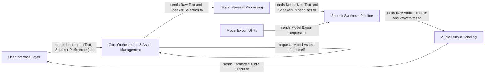

## Details

The ChatTTS project is structured as a robust ML toolkit for text-to-speech, emphasizing a clear, sequential data flow from user input to synthesized audio. It comprises a User Interface Layer for diverse interaction points, which feeds into the Core Orchestration & Asset Management component responsible for system control and resource handling. Text and speaker information are then prepared by the Text & Speaker Processing module before entering the high-performance Speech Synthesis Pipeline, which leverages a GPT model, vLLM, DVAE, and Vocos for audio generation. The resulting audio is refined by the Audio Output Handling component before being presented back to the user. An independent Model Export Utility supports deployment optimization. This architecture promotes modularity, allowing for clear component boundaries and a streamlined data flow, ideal for visual representation in a flow graph diagram.

### User Interface Layer
Provides various external interfaces (CLI, OpenAI API emulation, Web UI) for users to interact with the ChatTTS system, handling input and presenting final audio output.

**Related Classes/Methods**:

- <a href="git@github.com:2noise/ChatTTS.git/blob/main/temp/70b78003357a4b29a2b76e85f3268ced/examples/cmd/run.py" target="_blank" rel="noopener noreferrer">`examples/cmd/run.py`</a>
- <a href="git@github.com:2noise/ChatTTS.git/blob/main/temp/70b78003357a4b29a2b76e85f3268ced/examples/cmd/stream.py" target="_blank" rel="noopener noreferrer">`examples/cmd/stream.py`</a>
- <a href="git@github.com:2noise/ChatTTS.git/blob/main/temp/70b78003357a4b29a2b76e85f3268ced/examples/api/openai_api.py" target="_blank" rel="noopener noreferrer">`examples/api/openai_api.py`</a>
- <a href="git@github.com:2noise/ChatTTS.git/blob/main/temp/70b78003357a4b29a2b76e85f3268ced/examples/web/webui.py" target="_blank" rel="noopener noreferrer">`examples/web/webui.py`</a>
- <a href="git@github.com:2noise/ChatTTS.git/blob/main/temp/70b78003357a4b29a2b76e85f3268ced/examples/web/funcs.py" target="_blank" rel="noopener noreferrer">`examples/web/funcs.py`</a>

### Core Orchestration & Asset Management
Manages the overall system flow, including model loading, unloading, and orchestrating the inference pipeline, along with handling necessary model assets and configurations.

**Related Classes/Methods**:

- <a href="git@github.com:2noise/ChatTTS.git/blob/main/temp/70b78003357a4b29a2b76e85f3268ced/ChatTTS/core.py" target="_blank" rel="noopener noreferrer">`ChatTTS/core.py`</a>
- <a href="git@github.com:2noise/ChatTTS.git/blob/main/temp/70b78003357a4b29a2b76e85f3268ced/ChatTTS/utils/dl.py" target="_blank" rel="noopener noreferrer">`ChatTTS/utils/dl.py`</a>

### Text & Speaker Processing
Prepares input text by normalizing it and generates speaker embeddings, crucial steps before the core speech synthesis.

**Related Classes/Methods**:

- <a href="git@github.com:2noise/ChatTTS.git/blob/main/temp/70b78003357a4b29a2b76e85f3268ced/ChatTTS/norm.py" target="_blank" rel="noopener noreferrer">`ChatTTS/norm.py`</a>
- <a href="git@github.com:2noise/ChatTTS.git/blob/main/temp/70b78003357a4b29a2b76e85f3268ced/ChatTTS/model/speaker.py" target="_blank" rel="noopener noreferrer">`ChatTTS/model/speaker.py`</a>

### Speech Synthesis Pipeline
The central pipeline responsible for transforming processed text and speaker information into raw audio features and then into waveforms, leveraging performance optimizations like vLLM.

**Related Classes/Methods**:

- <a href="git@github.com:2noise/ChatTTS.git/blob/main/temp/70b78003357a4b29a2b76e85f3268ced/ChatTTS/model/gpt.py" target="_blank" rel="noopener noreferrer">`ChatTTS/model/gpt.py`</a>
- <a href="git@github.com:2noise/ChatTTS.git/blob/main/temp/70b78003357a4b29a2b76e85f3268ced/ChatTTS/model/velocity/llm.py" target="_blank" rel="noopener noreferrer">`ChatTTS/model/velocity/llm.py`</a>
- <a href="git@github.com:2noise/ChatTTS.git/blob/main/temp/70b78003357a4b29a2b76e85f3268ced/ChatTTS/model/velocity/llm_engine.py" target="_blank" rel="noopener noreferrer">`ChatTTS/model/velocity/llm_engine.py`</a>
- <a href="git@github.com:2noise/ChatTTS.git/blob/main/temp/70b78003357a4b29a2b76e85f3268ced/ChatTTS/model/velocity/model_runner.py" target="_blank" rel="noopener noreferrer">`ChatTTS.model.velocity.model_runner.py`</a>
- <a href="git@github.com:2noise/ChatTTS.git/blob/main/temp/70b78003357a4b29a2b76e85f3268ced/ChatTTS/model/velocity/scheduler.py" target="_blank" rel="noopener noreferrer">`ChatTTS/model/velocity/scheduler.py`</a>
- <a href="git@github.com:2noise/ChatTTS.git/blob/main/temp/70b78003357a4b29a2b76e85f3268ced/ChatTTS/model/velocity/block_manager.py" target="_blank" rel="noopener noreferrer">`ChatTTS/model/velocity/block_manager.py`</a>
- <a href="git@github.com:2noise/ChatTTS.git/blob/main/temp/70b78003357a4b29a2b76e85f3268ced/ChatTTS/model/dvae.py" target="_blank" rel="noopener noreferrer">`ChatTTS/model/dvae.py`</a>

### Audio Output Handling
Provides utilities for post-processing and formatting the generated audio before it is delivered to the user interfaces.

**Related Classes/Methods**:

- <a href="git@github.com:2noise/ChatTTS.git/blob/main/temp/70b78003357a4b29a2b76e85f3268ced/tools/audio/pcm.py" target="_blank" rel="noopener noreferrer">`tools/audio/pcm.py`</a>
- <a href="git@github.com:2noise/ChatTTS.git/blob/main/temp/70b78003357a4b29a2b76e85f3268ced/tools/audio/av.py" target="_blank" rel="noopener noreferrer">`tools/audio/av.py`</a>

### Model Export Utility
Facilitates the export of core models to the ONNX format for optimized deployment.

**Related Classes/Methods**:

- <a href="git@github.com:2noise/ChatTTS.git/blob/main/temp/70b78003357a4b29a2b76e85f3268ced/examples/onnx/exporter.py" target="_blank" rel="noopener noreferrer">`examples/onnx/exporter.py`</a>

### [FAQ](https://github.com/CodeBoarding/GeneratedOnBoardings/tree/main?tab=readme-ov-file#faq)