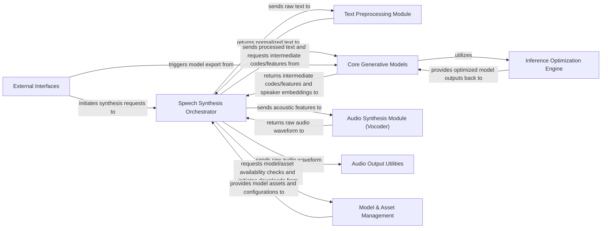

## Details

The ChatTTS architecture is structured as a comprehensive ML toolkit for text-to-speech synthesis, centered around a Speech Synthesis Orchestrator that manages the entire data flow. User interactions, whether via CLI, WebUI, or REST API, are handled by External Interfaces, which initiate synthesis requests. The input text first passes through the Text Preprocessing Module for normalization and tokenization. The processed text then enters the Core Generative Models (GPT, DVAE, and speaker embedding components), which transform it into acoustic features, with performance optimized by the Inference Optimization Engine. These acoustic features are subsequently converted into raw audio waveforms by the Audio Synthesis Module (Vocoder). The final audio is then managed by Audio Output Utilities for conversion and saving. Throughout the process, Model & Asset Management ensures that necessary model weights and configurations are loaded and available. Additionally, the External Interfaces also facilitate specialized operations like ONNX model export.

### Speech Synthesis Orchestrator [[Expand]](./Speech_Synthesis_Orchestrator.md)
The central control unit managing the entire text-to-speech pipeline. It orchestrates data flow from text input to final audio output, coordinating interactions between all core synthesis modules.

**Related Classes/Methods**:

- <a href="git@github.com:2noise/ChatTTS.git/blob/main/temp/61f936eb8766444da3d6592b4973b108/ChatTTS/core.py" target="_blank" rel="noopener noreferrer">`ChatTTS.core`</a>

### Text Preprocessing Module [[Expand]](./Text_Preprocessing_Module.md)
Handles the initial processing of raw input text, including normalization, language detection, and tokenization, to prepare it for the generative models.

**Related Classes/Methods**:

- <a href="git@github.com:2noise/ChatTTS.git/blob/main/temp/61f936eb8766444da3d6592b4973b108/ChatTTS/norm.py" target="_blank" rel="noopener noreferrer">`ChatTTS.norm`</a>
- <a href="git@github.com:2noise/ChatTTS.git/blob/main/temp/61f936eb8766444da3d6592b4973b108/ChatTTS/model/tokenizer.py" target="_blank" rel="noopener noreferrer">`ChatTTS.model.tokenizer`</a>

### Core Generative Models [[Expand]](./Core_Generative_Models.md)
Encompasses the primary neural network models responsible for transforming processed text into acoustic features and incorporating speaker characteristics (GPT-based text-to-code model, DVAE, and speaker embedding logic).

**Related Classes/Methods**:

- <a href="git@github.com:2noise/ChatTTS.git/blob/main/temp/61f936eb8766444da3d6592b4973b108/ChatTTS/model/gpt.py" target="_blank" rel="noopener noreferrer">`ChatTTS.model.gpt`</a>
- <a href="git@github.com:2noise/ChatTTS.git/blob/main/temp/61f936eb8766444da3d6592b4973b108/ChatTTS/model/dvae.py" target="_blank" rel="noopener noreferrer">`ChatTTS.model.dvae`</a>
- <a href="git@github.com:2noise/ChatTTS.git/blob/main/temp/61f936eb8766444da3d6592b4973b108/ChatTTS/model/speaker.py" target="_blank" rel="noopener noreferrer">`ChatTTS.model.speaker`</a>

### Inference Optimization Engine [[Expand]](./Inference_Optimization_Engine.md)
A high-performance backend (likely inspired by vLLM) dedicated to optimizing the execution of the large language models within the Core Generative Models. It manages GPU memory, batching, and request scheduling for efficient throughput.

**Related Classes/Methods**:

- <a href="git@github.com:2noise/ChatTTS.git/blob/main/temp/61f936eb8766444da3d6592b4973b108/ChatTTS/model/velocity/llm.py" target="_blank" rel="noopener noreferrer">`ChatTTS.model.velocity.llm`</a>
- <a href="git@github.com:2noise/ChatTTS.git/blob/main/temp/61f936eb8766444da3d6592b4973b108/ChatTTS/model/velocity/llm_engine.py" target="_blank" rel="noopener noreferrer">`ChatTTS.model.velocity.llm_engine`</a>
- <a href="git@github.com:2noise/ChatTTS.git/blob/main/temp/61f936eb8766444da3d6592b4973b108/ChatTTS/model/velocity/worker.py" target="_blank" rel="noopener noreferrer">`ChatTTS.model.velocity.worker`</a>

### Audio Synthesis Module (Vocoder) [[Expand]](./Audio_Synthesis_Module_Vocoder_.md)
The final stage of the synthesis pipeline, responsible for converting acoustic features into raw, audible audio waveforms using a vocoder (specifically, `vocos` integration).

**Related Classes/Methods**:

- <a href="git@github.com:2noise/ChatTTS.git/blob/main/temp/61f936eb8766444da3d6592b4973b108/ChatTTS/core.py" target="_blank" rel="noopener noreferrer">`ChatTTS.core`</a>

### Audio Output Utilities [[Expand]](./Audio_Output_Utilities.md)
Provides utilities for handling, converting, and saving the synthesized audio data into various common formats (e.g., WAV, MP3).

**Related Classes/Methods**:

- <a href="git@github.com:2noise/ChatTTS.git/blob/main/temp/61f936eb8766444da3d6592b4973b108/tools/audio/pcm.py" target="_blank" rel="noopener noreferrer">`tools.audio.pcm`</a>
- <a href="git@github.com:2noise/ChatTTS.git/blob/main/temp/61f936eb8766444da3d6592b4973b108/tools/audio/av.py" target="_blank" rel="noopener noreferrer">`tools.audio.av`</a>

### Model & Asset Management [[Expand]](./Model_Asset_Management.md)
Manages the lifecycle of model assets, including downloading necessary model weights and configuration files from remote sources, verifying their integrity, and loading configurations.

**Related Classes/Methods**:

- <a href="git@github.com:2noise/ChatTTS.git/blob/main/temp/61f936eb8766444da3d6592b4973b108/ChatTTS/utils/dl.py" target="_blank" rel="noopener noreferrer">`ChatTTS.utils.dl`</a>
- <a href="git@github.com:2noise/ChatTTS.git/blob/main/temp/61f936eb8766444da3d6592b4973b108/ChatTTS/config/config.py" target="_blank" rel="noopener noreferrer">`ChatTTS.config.config`</a>

### External Interfaces [[Expand]](./External_Interfaces.md)
Provides various interaction points for users and other applications to access the ChatTTS system, including command-line, web-based, RESTful API, and ONNX export functionalities.

**Related Classes/Methods**:

- <a href="git@github.com:2noise/ChatTTS.git/blob/main/temp/61f936eb8766444da3d6592b4973b108/examples/cmd/run.py" target="_blank" rel="noopener noreferrer">`examples.cmd.run`</a>
- <a href="git@github.com:2noise/ChatTTS.git/blob/main/temp/61f936eb8766444da3d6592b4973b108/examples/web/webui.py" target="_blank" rel="noopener noreferrer">`examples.web.webui`</a>
- <a href="git@github.com:2noise/ChatTTS.git/blob/main/temp/61f936eb8766444da3d6592b4973b108/examples/api/openai_api.py" target="_blank" rel="noopener noreferrer">`examples.api.openai_api`</a>
- <a href="git@github.com:2noise/ChatTTS.git/blob/main/temp/61f936eb8766444da3d6592b4973b108/examples/onnx/exporter.py" target="_blank" rel="noopener noreferrer">`examples.onnx.exporter`</a>

### [FAQ](https://github.com/CodeBoarding/GeneratedOnBoardings/tree/main?tab=readme-ov-file#faq)